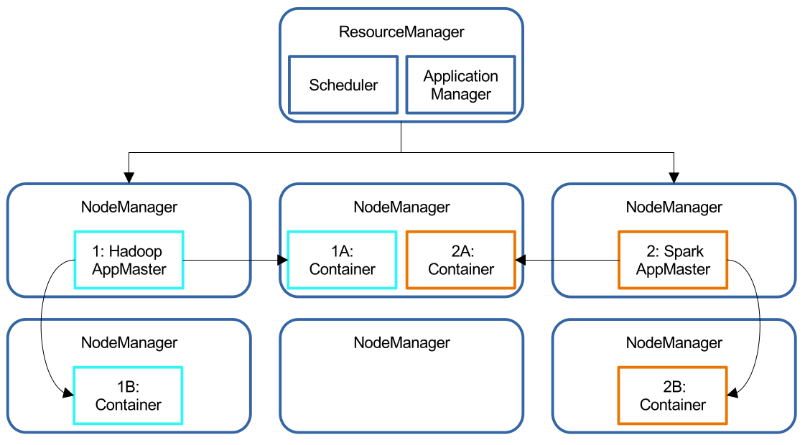

# Διαχείριση Πόρων και Εκτέλεση Εφαρμογών

## Εισαγωγή στη YARN
Το YARN είναι βασικό υποσύστημα του Hadoop και εξυπηρετεί δύο κύριες λειτουργίες:
- **Διαχείριση Πόρων**: Κατανομή διαθέσιμων πόρων σε εφαρμογές.
- **Προγραμματισμός/Παρακολούθηση Εργασιών**: Παρακολούθηση εκτελούμενων εργασιών.

## Κύριες Οντότητες στο YARN
1. **ResourceManager**:
   - Υπεύθυνος για την καθολική κατανομή πόρων.
   - Διαθέτει δύο μηχανισμούς: 
     - **Χρονοπρογραμματιστής**: Κατανομή πόρων με βάση αλγορίθμους.
     - **ApplicationManager**: Διαχείριση αιτήσεων χρήστη.

2. **NodeManager**:
   - "Εργάτης" που διαχειρίζεται τα κοντέινερ στον κόμβο.
   - Επικοινωνεί με τον ResourceManager, παρέχοντας δεδομένα για την κατάσταση των πόρων.

3. **ApplicationMaster**:
   - Συγκεκριμένος για κάθε εφαρμογή.
   - Διαχειρίζεται κοντέινερ και συνεργάζεται με τους NodeManagers για εκτέλεση εργασιών.

4. **Containers**:
   - Μονάδα πόρων (π.χ. μνήμη, CPU) που εκχωρείται σε εφαρμογές.

## Χρονοπρογραμματιστές του YARN
1. **FIFO**: Απλή σειρά προτεραιότητας.
2. **Χωρητικότητας (Capacity Scheduler)**:
   - Κατανομή πόρων με βάση ανάγκες εφαρμογών.
   - Εγγυήσεις χωρητικότητας για ουρές εργασιών.
3. **Fair Scheduler**:
   - Δίκαιη κατανομή πόρων, όπου όλες οι εφαρμογές λαμβάνουν ίσο μερίδιο μακροπρόθεσμα.

## Εκτέλεση Spark σε Cluster
Το Spark μπορεί να λειτουργεί σε cluster με τρεις βασικούς τρόπους:
1. **Cluster Mode**: Ο οδηγός (driver) τρέχει στον ίδιο το cluster.
2. **Client Mode**: Ο οδηγός τρέχει τοπικά και συνδέεται με το cluster.
3. **Local Mode**: Όλη η εφαρμογή εκτελείται σε έναν υπολογιστή.

## Κύκλος Ζωής Εφαρμογής Spark
1. **Αίτημα**: Υποβολή κώδικα στον cluster manager.
2. **Εκκίνηση**: Διαμόρφωση SparkSession και έναρξη διεργασιών.
3. **Εκτέλεση**: Επικοινωνία μεταξύ driver και workers.
4. **Ολοκλήρωση**: Τερματισμός διεργασιών και επιστροφή αποτελεσμάτων.

## SparkSession
- Απαραίτητο για την αρχικοποίηση εφαρμογών Spark.
- Παρέχει APIs για αλληλεπίδραση με το cluster.

## Διασωλήνωση και Shuffles
- **Διασωλήνωση (pipelining)**: Συνδυασμός λειτουργιών σε ένα στάδιο, χωρίς ενδιάμεση αποθήκευση.
- **Shuffles**: Επανακατανομή δεδομένων μεταξύ κόμβων, απαραίτητη για σύνθετες λειτουργίες.

---

## Εντολές

Για παράδειγμα με εντολές δείτε στο αρχείο [εδώ](Commands.md).
