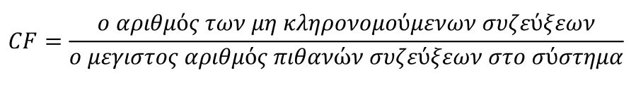

# Μετρικές Ποιότητας Λογισμικού

## 1. Εισαγωγή στις Μετρικές Ποιότητας Λογισμικού
Οι μετρήσεις είναι ουσιώδες εργαλείο για τη λειτουργία συστημάτων και την αξιολόγηση της ποιότητας λογισμικού. Χρησιμοποιούνται για:
- Την παρακολούθηση της απόδοσης.   
- Τη βελτίωση της συντήρησης και της ανάπτυξης λογισμικού.   
- Την κατανόηση και αξιολόγηση ποιοτικών χαρακτηριστικών.   

## 2. Ορισμοί και Θεμελιώδεις Έννοιες
- **Μέτρο**: Ποσοτική ένδειξη αριθμού, διαστάσεων ή χωρητικότητας.   
- **Μέτρηση**: Διαδικασία υπολογισμού του μέτρου.   
- **Μετρική**: Ποσοτική εκτίμηση του βαθμού κατά τον οποίο ένα σύστημα κατέχει ένα χαρακτηριστικό.   

**Παραδείγματα:**
- Αριθμός λαθών σε ένα πρόγραμμα (Μέτρο).   
- Συλλογή και καταμέτρηση λαθών (Μέτρηση).   
- Συσχέτιση λαθών με χαρακτηριστικά όπως η ποιότητα (Μετρική).   

### Είδη Ποσοτικοποίησης
1. **Άμεση ποσοτικοποίηση** (π.χ., Γραμμές Κώδικα - LOC).    

Βίντεο: [Lines of Code LoC](https://youtu.be/F-TGB_aUTyA?si=KAwxVcx8YySX8go0), 

2. **Έμμεση ποσοτικοποίηση** (π.χ., Παραγωγικότητα = LOC/ημέρες προσπάθειας).   

## 3. Μετρικές σε Διάφορες Φάσεις Ανάπτυξης
- **Πρώιμες φάσεις**: Χρήση εκτιμήσεων για προληπτικές διορθώσεις (π.χ., περιπτώσεις χρήσης, ιστορίες χρήστη).   
- **Αργότερες φάσεις**: Ακριβέστερη μέτρηση, αλλά υψηλότερο κόστος αλλαγών.   

## 4. Κατηγορίες Μετρικών Ποιότητας
### Μετρικές Μεγέθους
1. **Lines of Code (LoC):** Αριθμός γραμμών κώδικα χωρίς σχόλια/κενές γραμμές.   
2. **Number of Classes (NoC):** Αριθμός κλάσεων σε πακέτο ή σύστημα.   

### Μετρικές Πολυπλοκότητας

Ποσοτικοποιεί τον χρόνο και την προσπάθεια που απαιτείται για την ανάπτυξη και τη συντήρηση του λογισμικού.

1. **Cyclomatic Complexity (CC):** Μετρά τον αριθμό πιθανών μονοπατιών στον αλγόριθμο.
   - Τύπος: CC = L - N + 2P, όπου:   
     - L: Αριθμός ακμών γράφου.   
     - N: Αριθμός κόμβων γράφου.   
     - P: Αριθμός συνεκτικών συνιστωσών (συνήθως 1).   

Βίντεο: [Cyclomatic complexity and the impact on testing](https://youtu.be/9RvUj1Psqgk?si=mZRknlc2fmLZlNsV), [Cyclomatic Complexity Explained With Practical Examples](https://youtu.be/vmyS_j3Kh8g?si=i1BOsyaANT_ur3W-), [What is Cyclomatic Complexity in software development?](https://youtu.be/PDYmEtBSn60?si=7ieiKsdq_g_2Qxi3)

2. **Weighted Method per Class 1 (WMPC1)**:

Μετράει την πολυπλοκότητα μίας κλάσης, με βάση την πολυπλοκότητα των μεθόδων της. Ορίζεται ως ο μέσος όρος ή το άθροισμα των CC όλων της των μεθόδων.

Στη διαδικασία δεν περιλαμβάνονται μέθοδοι που κληρονομούνται από υπερκλάσεις.

Η τιμή της μετρικής για τις μεθόδους δεν πρέπει να υπερβαίνει το 10 ενώ για τις κλάσεις το 30. Για να μειωθούν οι τιμές πρέπει να σπάμε τις μεθόδους και τις κλάσεις.

3. **Weighted Method per Class 2(WMPC2)**:

Η συγκεκριμένη μετρική βασίζεται στην υπόθεση ότι μια κλάση με περισσότερες μεθόδους από μία άλλη είναι πιο σύνθετη.

Η μετρική αθροίζει τις μεθόδους και τις παραμέτρους των μεθόδων μιας κλάσης. Αποφεύγονται οι κλάσεις με τιμή μετρικής άνω του 100.

### Μετρικές Κληρονομικότητας
1. **Depth of Inheritance Tree (DIT):** Βάθος της κλάσης στην ιεραρχία.   

Βίντεο: [DIT | Depth of the Inheritance Tree | Software Engineering](https://youtu.be/OTM24QMohkI?si=nNaAF4jSG9ssbpA0)

2. **Number of Child Classes (NoCC):** Αριθμός κλάσεων που κληρονομούν από τη συγκεκριμένη.   

### Σύζευξη (Coupling)

Η σύζευξη **εξαρτάται** από :
- Κλήσεις από μία μονάδα σε άλλη   
- Ποσότητα δεδομένων που διακινείται από μία μονάδα σε άλλη   
- Το μέγεθος του ελέγχου που έχει μία μονάδα πάνω σε μία άλλη   

Η **ελαχιστοποίηση** της σύζευξης είναι επιθυμητή, για τους εξής λόγους:
- Ευκολότερη τροποποίηση των απαιτήσεων   
- Ευκολότερη σχεδίαση (δυνατότητα καταμερισμού εργασιών)   
- Ευκολότερος εντοπισμός σφαλμάτων συστήματος   
  - Ευκολότερο debugging   
  - Ευκολότερος έλεγχος - επικύρωση   
- Ευκολότερη συντήρηση   
- Σαφέστερη Τεκμηρίωση   

Βίντεο: [Coupling Between Classes - Intro to Java Programming](https://youtu.be/P3mVhTQl8F8?si=o53Zd18f9GWF2ygj), [Learn Java Programming - Coupling Tutorial](https://youtu.be/Eq5ReWFlc6w?si=BZ_oVVwB6RBYADf4)

**Μετρικές:**

1. **Coupling Factor (CF):** Σύζευξη σε επίπεδο συστήματος.   

Υπολογίζεται μόνο σε επίπεδο συστήματος

  - Αριθμητής είναι ο αριθμός των μη κληρονομούμενων συζεύξεων.   
  - Παρονομαστής είναι ο μέγιστος αριθμός πιθανών συζεύξεων στο σύστημα.   

Βίντεο: [Class Oriented Metrics|The MOOD Metrics Suite|Method Inheritance Factor|MIF|Coupling Factor|CF](https://youtu.be/aTYc-JFcL6A?si=hPYBUkBKwOUKwRRQ)

2. **Coupling Between Objects (CBO):** Σύζευξη μεταξύ κλάσεων (CBO=FO+FI).   

Βίντεο: [Coupling Between Object classes | CBO | Coupling in Software Engineering](https://youtu.be/w-Cg41nwjpw?si=PG5lb81gUzX5YwPq)

3. **Fan Out (FO):** Αριθμός ακμών που φεύγουν από μία κλάση.   

Μεγάλο Fan-Out => Η κλάση δεν είναι Αυτάρκης

4. **Fan In (FI):** Αριθμός ακμών που καταλήγουν σε μία κλάση.   

Μεγάλο Fan-In => Η κλάση παρέχει μεγάλη λειτουργικότητα

### Συνοχή (Cohesion)

Δύο μέθοδοι είναι συνεκτικές εάν τα μέλη δεδομένων που χρησιμοποιούν έχουν κοινά στοιχεία.

- υψηλή συνοχή => προάγει την ενθυλάκωση

Η έλλειψη συνοχής υποδηλώνει ότι η κλάση πιθανώς να πρέπει να διασπαστεί σε δύο ή περισσότερες κλάσεις.

Η έλλειψη συνοχής αυξάνει την πολυπλοκότητα και την πιθανότητα εμφάνισης λαθών κατά την ανάπτυξη.

Βίντεο: [Learn Java Programming - Cohesion Tutorial](https://youtu.be/IWSJD-7wkio?si=ToKQaCSvYata2dAG)

**Μετρική:**

1. **Lack of Cohesion of Methods (LCOM1):** Υπολογίζει αν οι μέθοδοι μιας κλάσης χρησιμοποιούν κοινά δεδομένα.
   - Τύπος: LCOM1 = P - Q (όπου P: ασύνδετες μέθοδοι, Q: συνεκτικές μέθοδοι).   

  - LCOM1 = 0, σημαίνει συνεκτική κλάση.   
  - LCOM1 > 0, σημαίνει ότι η κλάση πρέπει να ‘σπάσει’ σε δύο ή περισσότερες κλάσεις, καθότι οι μεταβλητές τους ανήκουν σε διαφορετικά σύνολα.   

Βίντεο: [Lack of Cohesion in Methods | LCOM | Lack of Cohesion](https://youtu.be/D6rzMQKnFGg?si=_S0qjSwHk-H3vAJx)

Βίντεο Σύζευξης-Συνοχής: [Coupling and Cohesion Explained](https://www.youtube.com/watch?v=7pdrZDqEPIw), [Coupling vs Cohesion Explained | QuiCap](https://youtu.be/TCMGU7-Ir_k?si=tmG_BGijozpg4pJf)

## 5. Αρχές Χαμηλής Σύζευξης και Συνοχής
- **Χαμηλή Σύζευξη**: Μικρότερη δυνατή εξάρτηση μεταξύ συστατικών για ευκολότερη συντήρηση και τροποποιήσεις.   
- **Υψηλή Συνοχή**: Ενίσχυση της ενθυλάκωσης και μείωση πολυπλοκότητας.   

## 6. Προτάσεις για Καλή Ποιότητα Κώδικα
Ένας καλός κώδικας πρέπει:
- Να είναι ευέλικτος (επανάχρηση και προσαρμοστικότητα).   
- Να είναι συντηρήσιμος (εύκολη κατανόηση και διόρθωση).   
- Να έχει χαμηλή πολυπλοκότητα και σαφή σχολιασμό.   
- Να ακολουθεί πρότυπα ποιότητας (π.χ., ISO 9126).   

**Σημείωση:** Οι μετρικές πρέπει να επιλέγονται βάσει της ικανότητάς τους να προβλέπουν την ποιότητα σχεδίασης και να είναι ανεξάρτητες από τη γλώσσα προγραμματισμού.

---

## 7. Βίντεο 
- [Object Oriented Metrics](https://youtu.be/FmPAEJkSRag?si=VgFzb-e_J5CL5X1i)   
- [Object Oriented Metrics // Object Oriented Analysis and Design (ICS)](https://youtu.be/SWL7R_DtXbE?si=PrvxtgQnTVx4aj03)    
- [Class Oriented Metrics | CK Metrics Suite | WMC DIT NOC CBO RFC LCOM](https://youtu.be/OSe-306xEUk?si=FlEwrwvgdTMK-ppL)
