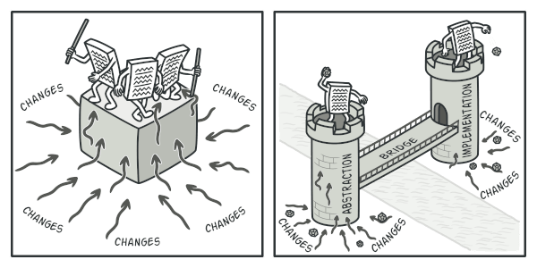

# Bridge

## Σκοπός

Το Bridge είναι ένα δομικό μοτίβο σχεδιασμού που σας επιτρέπει να χωρίσετε μια μεγάλη κλάση (class) ή ένα σύνολο στενά συνδεδεμένων κλάσεων σε δύο ξεχωριστές ιεραρχίες —αφαίρεση και υλοποίηση— οι οποίες μπορούν να αναπτυχθούν ανεξάρτητα η μία από την άλλη.

## Πρόβλημα

Αφαίρεση; Υλοποίηση; Ακούγεται τρομακτικό; Μείνετε ήρεμοι και ας δούμε ένα απλό παράδειγμα.

Ας πούμε ότι έχετε μια γεωμετρική κλάση `Shape` με δύο υποκλάσεις: `Circle` και `Square`. Θέλετε να επεκτείνετε αυτή την ιεραρχία κλάσεων για να ενσωματώσετε τα χρώματα, οπότε σκοπεύετε να δημιουργήσετε υποκλάσεις σχήματος `Red` και `Blue`. Ωστόσο, δεδομένου ότι έχετε ήδη δύο υποκλάσεις, θα πρέπει να δημιουργήσετε τέσσερις συνδυασμούς κλάσεων, όπως `BlueCircle` και `RedSquare`.

|  | 
|:--:| 
| *Ο αριθμός των συνδυασμών κλάσεων αυξάνεται με γεωμετρική πρόοδο.* |

Η προσθήκη νέων τύπων σχημάτων και χρωμάτων στην ιεραρχία θα την αυξήσει εκθετικά. Για παράδειγμα, για να προσθέσετε ένα τριγωνικό σχήμα θα πρέπει να εισαγάγετε δύο υποκλάσεις, μία για κάθε χρώμα. Και μετά από αυτό, η προσθήκη ενός νέου χρώματος θα απαιτούσε τη δημιουργία τριών υποκλάσεων, μία για κάθε τύπο σχήματος. Όσο προχωράμε, τόσο χειρότερα γίνεται.

## Λύση

Αυτό το πρόβλημα εμφανίζεται επειδή προσπαθούμε να επεκτείνουμε τις κλάσεις shape σε δύο ανεξάρτητες διαστάσεις: ανά μορφή και ανά χρώμα. Αυτό είναι ένα πολύ συνηθισμένο πρόβλημα με την κληρονομικότητα κλάσεων. 

Το πρότυπο Bridge προσπαθεί να λύσει αυτό το πρόβλημα μεταβαίνοντας από την κληρονομικότητα στη σύνθεση αντικειμένων. Αυτό σημαίνει ότι εξάγετε μια από τις διαστάσεις σε μια ξεχωριστή ιεραρχία κλάσεων, έτσι ώστε οι αρχικές κλάσεις να αναφέρονται σε ένα αντικείμενο της νέας ιεραρχίας, αντί να έχουν όλη την κατάσταση και τις συμπεριφορές τους μέσα σε μια κλάση.

|  | 
|:--:| 
| *Μπορείτε να αποτρέψετε την αύξηση μιας ιεραρχίας κλάσεων μετασχηματίζοντάς την σε διάφορες συναφείς ιεραρχίες.* |

Ακολουθώντας αυτή την προσέγγιση, μπορούμε να εξάγουμε τον κώδικα που σχετίζεται με το χρώμα σε δική του κλάση με δύο υποκλάσεις: `Red` και `Blue`. Στη συνέχεια, η κλάση `Shape` αποκτά ένα πεδίο αναφοράς που δείχνει σε ένα από τα χρωματικά αντικείμενα. Τώρα το σχήμα μπορεί να αναθέσει κάθε εργασία που σχετίζεται με το χρώμα στο συνδεδεμένο αντικείμενο χρώματος. Αυτή η αναφορά θα λειτουργεί ως γέφυρα μεταξύ των κλάσεων `Shape` και `Color`. Από εδώ και στο εξής, η προσθήκη νέων χρωμάτων δεν θα απαιτεί αλλαγή της ιεραρχίας του σχήματος και το αντίστροφο.

## Αφαίρεση και υλοποίηση

Το βιβλίο GoF εισάγει τους όρους Αφαίρεση και Υλοποίηση ως μέρος του ορισμού του πρότυπου Bridge. Οι όροι ακούγονται πολύ ακαδημαϊκοί και κάνουν το πρότυπο να φαίνεται πιο περίπλοκο από ό,τι είναι στην πραγματικότητα. Έχοντας διαβάσει το απλό παράδειγμα με τα σχήματα και τα χρώματα, ας αποκρυπτογραφήσουμε το νόημα πίσω από τις τρομακτικές λέξεις του βιβλίου GoF. 

Η αφαίρεση (που ονομάζεται επίσης διεπαφή) είναι ένα υψηλού επιπέδου επίπεδο ελέγχου για κάποια οντότητα. Αυτό το επίπεδο υποτίθεται ότι δεν πρέπει να κάνει καμία πραγματική δουλειά από μόνο του. Θα πρέπει να αναθέτει την εργασία στο επίπεδο υλοποίησης (που ονομάζεται επίσης πλατφόρμα). 

Σημειώστε ότι δεν μιλάμε για διεπαφές ή αφηρημένες κλάσεις από τη γλώσσα προγραμματισμού σας. Αυτά δεν είναι τα ίδια πράγματα.

Όταν μιλάμε για πραγματικές εφαρμογές, η αφαίρεση μπορεί να αντιπροσωπεύεται από μια γραφική διεπαφή χρήστη (GUI) και η υλοποίηση μπορεί να είναι ο υποκείμενος κώδικας του λειτουργικού συστήματος (API), τον οποίο το επίπεδο GUI καλεί ως απάντηση στις αλληλεπιδράσεις του χρήστη.

Σε γενικές γραμμές, μπορείτε να επεκτείνετε μια τέτοια εφαρμογή προς δύο ανεξάρτητες κατευθύνσεις: 

- Να έχετε πολλά διαφορετικά γραφικά περιβάλλοντα (για παράδειγμα, προσαρμοσμένα για τακτικούς πελάτες ή διαχειριστές).   
- Να υποστηρίζετε πολλά διαφορετικά API (για παράδειγμα, για να μπορείτε να εκκινήσετε την εφαρμογή κάτω από Windows, Linux και macOS).    

Στη χειρότερη περίπτωση, αυτή η εφαρμογή μπορεί να μοιάζει με ένα γιγαντιαίο μπολ σπαγγέτι, όπου εκατοντάδες conditionals συνδέουν διαφορετικούς τύπους γραφικών περιβάλλοντων με διάφορα API σε όλο τον κώδικα.

|  | 
|:--:| 
| *Η πραγματοποίηση ακόμη και μιας απλής αλλαγής σε μια μονολιθική βάση κώδικα είναι αρκετά δύσκολη, επειδή πρέπει να καταλάβετε το όλο θέμα πολύ καλά. Η πραγματοποίηση αλλαγών σε μικρότερες, καλά καθορισμένες ενότητες είναι πολύ πιο εύκολη.* |

Μπορείτε να βάλετε τάξη σε αυτό το χάος, αποσπώντας τον κώδικα που σχετίζεται με συγκεκριμένους συνδυασμούς διεπαφής-πλατφόρμας σε ξεχωριστές κλάσεις. Ωστόσο, σύντομα θα ανακαλύψετε ότι υπάρχουν πολλές τέτοιες κλάσεις. Η ιεραρχία των κλάσεων θα αυξηθεί εκθετικά επειδή η προσθήκη ενός νέου GUI ή η υποστήριξη ενός διαφορετικού API θα απαιτήσει τη δημιουργία όλο και περισσότερων κλάσεων.

Ας προσπαθήσουμε να λύσουμε αυτό το πρόβλημα με το μοτίβο Bridge. Προτείνει να χωρίσουμε τις κλάσεις σε δύο ιεραρχίες: 

- Αφαίρεση: το επίπεδο GUI της εφαρμογής.     
- Υλοποίηση: τα APIs των λειτουργικών συστημάτων.   

|  | 
|:--:| 
| *Ένας από τους τρόπους δόμησης μιας εφαρμογής πολλαπλών πλατφορμών.* |

Το αντικείμενο αφαίρεσης ελέγχει την εμφάνιση της εφαρμογής, αναθέτοντας την πραγματική εργασία στο συνδεδεμένο αντικείμενο υλοποίησης. Διαφορετικές υλοποιήσεις είναι εναλλάξιμες εφόσον ακολουθούν μια κοινή διεπαφή, επιτρέποντας στο ίδιο GUI να λειτουργεί κάτω από Windows και Linux. 

Ως αποτέλεσμα, μπορείτε να αλλάξετε τις κλάσεις GUI χωρίς να αγγίξετε τις κλάσεις που σχετίζονται με το API. Επιπλέον, η προσθήκη υποστήριξης για άλλο λειτουργικό σύστημα απαιτεί μόνο τη δημιουργία μιας υποκλάσης στην ιεραρχία υλοποίησης.

[refactoring.guru](https://refactoring.guru/design-patterns/bridge)
