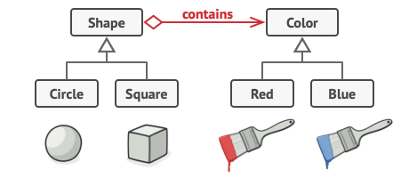

# Bridge

## Σκοπός

Το Bridge είναι ένα δομικό μοτίβο σχεδιασμού που σας επιτρέπει να χωρίσετε μια μεγάλη κλάση (class) ή ένα σύνολο στενά συνδεδεμένων κλάσεων σε δύο ξεχωριστές ιεραρχίες —αφαίρεση και υλοποίηση— οι οποίες μπορούν να αναπτυχθούν ανεξάρτητα η μία από την άλλη.


## Πρόβλημα

Αφαίρεση; Υλοποίηση; Ακούγεται τρομακτικό; Μείνετε ήρεμοι και ας δούμε ένα απλό παράδειγμα.

Ας πούμε ότι έχετε μια γεωμετρική κλάση `Shape` με δύο υποκλάσεις: `Circle` και `Square`. Θέλετε να επεκτείνετε αυτή την ιεραρχία κλάσεων για να ενσωματώσετε τα χρώματα, οπότε σκοπεύετε να δημιουργήσετε υποκλάσεις σχήματος `Red` και `Blue`. Ωστόσο, δεδομένου ότι έχετε ήδη δύο υποκλάσεις, θα πρέπει να δημιουργήσετε τέσσερις συνδυασμούς κλάσεων, όπως `BlueCircle` και `RedSquare`.

|  | 
|:--:| 
| *Ο αριθμός των συνδυασμών κλάσεων αυξάνεται με γεωμετρική πρόοδο.* |

Η προσθήκη νέων τύπων σχημάτων και χρωμάτων στην ιεραρχία θα την αυξήσει εκθετικά. Για παράδειγμα, για να προσθέσετε ένα τριγωνικό σχήμα θα πρέπει να εισαγάγετε δύο υποκλάσεις, μία για κάθε χρώμα. Και μετά από αυτό, η προσθήκη ενός νέου χρώματος θα απαιτούσε τη δημιουργία τριών υποκλάσεων, μία για κάθε τύπο σχήματος. Όσο προχωράμε, τόσο χειρότερα γίνεται.

## Λύση

Αυτό το πρόβλημα εμφανίζεται επειδή προσπαθούμε να επεκτείνουμε τις κλάσεις shape σε δύο ανεξάρτητες διαστάσεις: ανά μορφή και ανά χρώμα. Αυτό είναι ένα πολύ συνηθισμένο πρόβλημα με την κληρονομικότητα κλάσεων. 

Το πρότυπο Bridge προσπαθεί να λύσει αυτό το πρόβλημα μεταβαίνοντας από την κληρονομικότητα στη σύνθεση αντικειμένων. Αυτό σημαίνει ότι εξάγετε μια από τις διαστάσεις σε μια ξεχωριστή ιεραρχία κλάσεων, έτσι ώστε οι αρχικές κλάσεις να αναφέρονται σε ένα αντικείμενο της νέας ιεραρχίας, αντί να έχουν όλη την κατάσταση και τις συμπεριφορές τους μέσα σε μια κλάση.

|  | 
|:--:| 
| *Μπορείτε να αποτρέψετε την αύξηση μιας ιεραρχίας κλάσεων μετασχηματίζοντάς την σε διάφορες συναφείς ιεραρχίες.* |

Ακολουθώντας αυτή την προσέγγιση, μπορούμε να εξάγουμε τον κώδικα που σχετίζεται με το χρώμα σε δική του κλάση με δύο υποκλάσεις: `Red` και `Blue`. Στη συνέχεια, η κλάση `Shape` αποκτά ένα πεδίο αναφοράς που δείχνει σε ένα από τα χρωματικά αντικείμενα. Τώρα το σχήμα μπορεί να αναθέσει κάθε εργασία που σχετίζεται με το χρώμα στο συνδεδεμένο αντικείμενο χρώματος. Αυτή η αναφορά θα λειτουργεί ως γέφυρα μεταξύ των κλάσεων `Shape` και `Color`. Από εδώ και στο εξής, η προσθήκη νέων χρωμάτων δεν θα απαιτεί αλλαγή της ιεραρχίας του σχήματος και το αντίστροφο.

## Αφαίρεση και υλοποίηση

Το βιβλίο GoF εισάγει τους όρους Αφαίρεση και Υλοποίηση ως μέρος του ορισμού του πρότυπου Bridge. Οι όροι ακούγονται πολύ ακαδημαϊκοί και κάνουν το πρότυπο να φαίνεται πιο περίπλοκο από ό,τι είναι στην πραγματικότητα. Έχοντας διαβάσει το απλό παράδειγμα με τα σχήματα και τα χρώματα, ας αποκρυπτογραφήσουμε το νόημα πίσω από τις τρομακτικές λέξεις του βιβλίου GoF. 

Η αφαίρεση (που ονομάζεται επίσης διεπαφή) είναι ένα υψηλού επιπέδου επίπεδο ελέγχου για κάποια οντότητα. Αυτό το επίπεδο υποτίθεται ότι δεν πρέπει να κάνει καμία πραγματική δουλειά από μόνο του. Θα πρέπει να αναθέτει την εργασία στο επίπεδο υλοποίησης (που ονομάζεται επίσης πλατφόρμα). 

Σημειώστε ότι δεν μιλάμε για διεπαφές ή αφηρημένες κλάσεις από τη γλώσσα προγραμματισμού σας. Αυτά δεν είναι τα ίδια πράγματα.

Όταν μιλάμε για πραγματικές εφαρμογές, η αφαίρεση μπορεί να αντιπροσωπεύεται από μια γραφική διεπαφή χρήστη (GUI) και η υλοποίηση μπορεί να είναι ο υποκείμενος κώδικας του λειτουργικού συστήματος (API), τον οποίο το επίπεδο GUI καλεί ως απάντηση στις αλληλεπιδράσεις του χρήστη.

Σε γενικές γραμμές, μπορείτε να επεκτείνετε μια τέτοια εφαρμογή προς δύο ανεξάρτητες κατευθύνσεις: 

- Να έχετε πολλά διαφορετικά γραφικά περιβάλλοντα (για παράδειγμα, προσαρμοσμένα για τακτικούς πελάτες ή διαχειριστές).   
- Να υποστηρίζετε πολλά διαφορετικά API (για παράδειγμα, για να μπορείτε να εκκινήσετε την εφαρμογή κάτω από Windows, Linux και macOS).    

Στη χειρότερη περίπτωση, αυτή η εφαρμογή μπορεί να μοιάζει με ένα γιγαντιαίο μπολ σπαγγέτι, όπου εκατοντάδες conditionals συνδέουν διαφορετικούς τύπους γραφικών περιβάλλοντων με διάφορα API σε όλο τον κώδικα.

|  | 
|:--:| 
| *Η πραγματοποίηση ακόμη και μιας απλής αλλαγής σε μια μονολιθική βάση κώδικα είναι αρκετά δύσκολη, επειδή πρέπει να καταλάβετε το όλο θέμα πολύ καλά. Η πραγματοποίηση αλλαγών σε μικρότερες, καλά καθορισμένες ενότητες είναι πολύ πιο εύκολη.* |

Μπορείτε να βάλετε τάξη σε αυτό το χάος, αποσπώντας τον κώδικα που σχετίζεται με συγκεκριμένους συνδυασμούς διεπαφής-πλατφόρμας σε ξεχωριστές κλάσεις. Ωστόσο, σύντομα θα ανακαλύψετε ότι υπάρχουν πολλές τέτοιες κλάσεις. Η ιεραρχία των κλάσεων θα αυξηθεί εκθετικά επειδή η προσθήκη ενός νέου GUI ή η υποστήριξη ενός διαφορετικού API θα απαιτήσει τη δημιουργία όλο και περισσότερων κλάσεων.

Ας προσπαθήσουμε να λύσουμε αυτό το πρόβλημα με το μοτίβο Bridge. Προτείνει να χωρίσουμε τις κλάσεις σε δύο ιεραρχίες: 

- Αφαίρεση: το επίπεδο GUI της εφαρμογής.     
- Υλοποίηση: τα APIs των λειτουργικών συστημάτων.   

|  | 
|:--:| 
| *Ένας από τους τρόπους δόμησης μιας εφαρμογής πολλαπλών πλατφορμών.* |

Το αντικείμενο αφαίρεσης ελέγχει την εμφάνιση της εφαρμογής, αναθέτοντας την πραγματική εργασία στο συνδεδεμένο αντικείμενο υλοποίησης. Διαφορετικές υλοποιήσεις είναι εναλλάξιμες εφόσον ακολουθούν μια κοινή διεπαφή, επιτρέποντας στο ίδιο GUI να λειτουργεί κάτω από Windows και Linux. 

Ως αποτέλεσμα, μπορείτε να αλλάξετε τις κλάσεις GUI χωρίς να αγγίξετε τις κλάσεις που σχετίζονται με το API. Επιπλέον, η προσθήκη υποστήριξης για άλλο λειτουργικό σύστημα απαιτεί μόνο τη δημιουργία μιας υποκλάσης στην ιεραρχία υλοποίησης.

## Δομή

|  | 
|:--:| 
| *Η πραγματοποίηση ακόμη και μιας απλής αλλαγής σε μια μονολιθική βάση κώδικα είναι αρκετά δύσκολη, επειδή πρέπει να καταλάβετε το όλο θέμα πολύ καλά. Η πραγματοποίηση αλλαγών σε μικρότερες, καλά καθορισμένες ενότητες είναι πολύ πιο εύκολη.* |

1. Η **αφαίρεση** παρέχει λογική ελέγχου υψηλού επιπέδου. Βασίζεται στο αντικείμενο υλοποίησης για να κάνει την πραγματική εργασία χαμηλού επιπέδου.   
2. Η **υλοποίηση** δηλώνει τη διεπαφή που είναι κοινή για όλες τις συγκεκριμένες υλοποιήσεις. Μια αφαίρεση μπορεί να επικοινωνήσει με ένα αντικείμενο υλοποίησης μόνο μέσω μεθόδων που δηλώνονται εδώ.   
Η αφαίρεση μπορεί να απαριθμεί τις ίδιες μεθόδους με την υλοποίηση, αλλά συνήθως η αφαίρεση δηλώνει κάποιες σύνθετες συμπεριφορές που βασίζονται σε μια μεγάλη ποικιλία πρωτόγονων λειτουργιών που δηλώνονται από την υλοποίηση.
3. Οι **συγκεκριμένες υλοποιήσεις** περιέχουν κώδικα για συγκεκριμένες πλατφόρμες.   
4. Οι **εκλεπτυσμένες αφαιρέσεις** παρέχουν παραλλαγές της λογικής ελέγχου. Όπως και ο γονέας τους, συνεργάζονται με διαφορετικές υλοποιήσεις μέσω της γενικής διεπαφής υλοποίησης.   
5. Συνήθως, ο **Πελάτης** ενδιαφέρεται μόνο να εργαστεί με την αφαίρεση. Ωστόσο, είναι δουλειά του πελάτη να συνδέσει το αντικείμενο αφαίρεσης με ένα από τα αντικείμενα υλοποίησης.   

## Ψευδοκώδικας

Αυτό το παράδειγμα δείχνει πώς το μοτίβο **Bridge** μπορεί να βοηθήσει στη διαίρεση του μονολιθικού κώδικα μιας εφαρμογής που διαχειρίζεται συσκευές και τα τηλεχειριστήριά τους. Οι κλάσεις `Device` ενεργούν ως υλοποίηση, ενώ οι κλάσεις `Remote` ενεργούν ως αφαίρεση.

|  | 
|:--:| 
| *Η αρχική ιεραρχία κλάσεων χωρίζεται σε δύο μέρη: συσκευές και τηλεχειριστήρια.* |

Η βασική κλάση τηλεχειρισμού δηλώνει ένα πεδίο αναφοράς που τη συνδέει με ένα αντικείμενο συσκευής. Όλα τα τηλεχειριστήρια συνεργάζονται με τις συσκευές μέσω της γενικής διεπαφής συσκευής, η οποία επιτρέπει στο ίδιο τηλεχειριστήριο να υποστηρίζει πολλούς τύπους συσκευών. 

Μπορείτε να αναπτύξετε τις κλάσεις τηλεχειριστηρίων ανεξάρτητα από τις κλάσεις συσκευών. Το μόνο που χρειάζεται είναι να δημιουργήσετε μια νέα υποκλάση τηλεχειριστηρίου. Για παράδειγμα, ένα βασικό τηλεχειριστήριο μπορεί να έχει μόνο δύο κουμπιά, αλλά μπορείτε να το επεκτείνετε με πρόσθετα χαρακτηριστικά, όπως μια επιπλέον μπαταρία ή μια οθόνη αφής. 

Ο κώδικας του πελάτη συνδέει τον επιθυμητό τύπο τηλεχειριστηρίου με ένα συγκεκριμένο αντικείμενο συσκευής μέσω του κατασκευαστή του τηλεχειριστηρίου.

```
// The "abstraction" defines the interface for the "control"
// part of the two class hierarchies. It maintains a reference
// to an object of the "implementation" hierarchy and delegates
// all of the real work to this object.
class RemoteControl is
    protected field device: Device
    constructor RemoteControl(device: Device) is
        this.device = device
    method togglePower() is
        if (device.isEnabled()) then
            device.disable()
        else
            device.enable()
    method volumeDown() is
        device.setVolume(device.getVolume() - 10)
    method volumeUp() is
        device.setVolume(device.getVolume() + 10)
    method channelDown() is
        device.setChannel(device.getChannel() - 1)
    method channelUp() is
        device.setChannel(device.getChannel() + 1)


// You can extend classes from the abstraction hierarchy
// independently from device classes.
class AdvancedRemoteControl extends RemoteControl is
    method mute() is
        device.setVolume(0)


// The "implementation" interface declares methods common to all
// concrete implementation classes. It doesn't have to match the
// abstraction's interface. In fact, the two interfaces can be
// entirely different. Typically the implementation interface
// provides only primitive operations, while the abstraction
// defines higher-level operations based on those primitives.
interface Device is
    method isEnabled()
    method enable()
    method disable()
    method getVolume()
    method setVolume(percent)
    method getChannel()
    method setChannel(channel)


// All devices follow the same interface.
class Tv implements Device is
    // ...

class Radio implements Device is
    // ...


// Somewhere in client code.
tv = new Tv()
remote = new RemoteControl(tv)
remote.togglePower()

radio = new Radio()
remote = new AdvancedRemoteControl(radio)
```

## Εφαρμογή

- **Χρησιμοποιήστε το πρότυπο Bridge όταν θέλετε να διαιρέσετε και να οργανώσετε μια μονολιθική κλάση που έχει διάφορες παραλλαγές κάποιας λειτουργικότητας (για παράδειγμα, αν η κλάση μπορεί να συνεργαστεί με διάφορους διακομιστές βάσεων δεδομένων)**.   

Όσο μεγαλύτερη γίνεται μια κλάση, τόσο πιο δύσκολο είναι να καταλάβουμε πώς λειτουργεί και τόσο περισσότερο χρόνο χρειάζεται για να γίνει μια αλλαγή. Οι αλλαγές που γίνονται σε μία από τις παραλλαγές της λειτουργικότητας μπορεί να απαιτούν αλλαγές σε ολόκληρη την κλάση, γεγονός που συχνά έχει ως αποτέλεσμα να γίνονται λάθη ή να μην αντιμετωπίζονται κάποιες κρίσιμες παρενέργειες. 

Το πρότυπο Bridge σας επιτρέπει να χωρίσετε τη μονολιθική κλάση σε διάφορες ιεραρχίες κλάσεων. Μετά από αυτό, μπορείτε να αλλάξετε τις κλάσεις σε κάθε ιεραρχία ανεξάρτητα από τις κλάσεις στις άλλες. Αυτή η προσέγγιση απλοποιεί τη συντήρηση του κώδικα και ελαχιστοποιεί τον κίνδυνο παραβίασης του υπάρχοντος κώδικα.

- **Χρησιμοποιήστε το πρότυπο όταν πρέπει να επεκτείνετε μια κλάση σε πολλές ορθογώνιες (ανεξάρτητες) διαστάσεις**.

Το πρότυπο Bridge προτείνει να εξάγετε μια ξεχωριστή ιεραρχία κλάσεων για κάθε μια από τις διαστάσεις. Η αρχική κλάση αναθέτει τη σχετική εργασία στα αντικείμενα που ανήκουν σε αυτές τις ιεραρχίες αντί να κάνει τα πάντα μόνη της.

- **Χρησιμοποιήστε το πρότυπο Bridge αν θέλετε να μπορείτε να αλλάζετε υλοποιήσεις κατά την εκτέλεση**.

Αν και είναι προαιρετικό, το πρότυπο Bridge σας επιτρέπει να αντικαταστήσετε το αντικείμενο υλοποίησης μέσα στην αφαίρεση. Είναι τόσο εύκολο όσο η ανάθεση μιας νέας τιμής σε ένα πεδίο. 

Παρεμπιπτόντως, αυτό το τελευταίο στοιχείο είναι ο κύριος λόγος για τον οποίο τόσοι πολλοί άνθρωποι συγχέουν το πρότυπο Bridge με το πρότυπο [Strategy](https://refactoring.guru/design-patterns/strategy) (δείτε [εδώ](https://github.com/iosifidis/msc_applied_informatics/tree/main/s1/Software%20Systems%20Engineering/excersices/week2)). Να θυμάστε ότι ένα μοτίβο είναι κάτι περισσότερο από έναν συγκεκριμένο τρόπο δόμησης των κλάσεών σας. Μπορεί επίσης να επικοινωνεί την πρόθεση και ένα πρόβλημα που αντιμετωπίζεται.

## Πώς να εφαρμόσετε

1. Προσδιορίστε τις ορθογώνιες διαστάσεις στις κλάσεις σας. Αυτές οι ανεξάρτητες έννοιες θα μπορούσαν να είναι: αφαίρεση/πλατφόρμα, τομέας/υποδομή, front-end/back-end ή διεπαφή/υλοποίηση.   

2. Δείτε ποιες λειτουργίες χρειάζεται ο πελάτης και ορίστε τις στη βασική κλάση αφαίρεσης.  

3. Καθορίστε τις λειτουργίες που είναι διαθέσιμες σε όλες τις πλατφόρμες. Δηλώστε αυτές που χρειάζεται η αφαίρεση στη γενική διεπαφή υλοποίησης.   

4. Για όλες τις πλατφόρμες του τομέα σας δημιουργήστε συγκεκριμένες κλάσεις υλοποίησης, αλλά βεβαιωθείτε ότι όλες ακολουθούν τη διεπαφή υλοποίησης.   

5. Μέσα στην κλάση αφαίρεσης, προσθέστε ένα πεδίο αναφοράς για τον τύπο υλοποίησης. Η αφαίρεση αναθέτει το μεγαλύτερο μέρος της εργασίας στο αντικείμενο υλοποίησης που αναφέρεται σε αυτό το πεδίο.    

6. Αν έχετε πολλές παραλλαγές της λογικής υψηλού επιπέδου, δημιουργήστε εκλεπτυσμένες αφαιρέσεις για κάθε παραλλαγή επεκτείνοντας τη βασική κλάση αφαίρεσης.    

7. Ο κώδικας του πελάτη θα πρέπει να περάσει ένα αντικείμενο υλοποίησης στον κατασκευαστή της αφαίρεσης για να συσχετίσει το ένα με το άλλο. Μετά από αυτό, ο πελάτης μπορεί να ξεχάσει την υλοποίηση και να εργάζεται μόνο με το αντικείμενο της αφαίρεσης.

## Πλεονεκτήματα και μειονεκτήματα

### Πλεονεκτήματα

- Μπορείτε να δημιουργήσετε κλάσεις και εφαρμογές ανεξάρτητες από την πλατφόρμα.    
- Ο κώδικας του πελάτη λειτουργεί με αφαιρέσεις υψηλού επιπέδου. Δεν είναι εκτεθειμένος στις λεπτομέρειες της πλατφόρμας.    
- Ανοιχτή/κλειστή αρχή. Μπορείτε να εισαγάγετε νέες αφαιρέσεις και υλοποιήσεις ανεξάρτητα η μία από την άλλη.     
- Αρχή της ενιαίας ευθύνης. Μπορείτε να επικεντρωθείτε στη λογική υψηλού επιπέδου στην αφαίρεση και στις λεπτομέρειες της πλατφόρμας στην υλοποίηση.

### Μειονεκτήματα

- Θα μπορούσατε να κάνετε τον κώδικα πιο περίπλοκο εφαρμόζοντας το πρότυπο σε μια ιδιαίτερα συνεκτική κλάση.

## Σχέσεις με άλλα μοτίβα

- Το μοτίβο Bridge συνήθως σχεδιάζεται εκ των προτέρων, επιτρέποντάς σας να αναπτύξετε τμήματα μιας εφαρμογής ανεξάρτητα το ένα από το άλλο. Από την άλλη πλευρά, το [Adapter](https://refactoring.guru/design-patterns/adapter) χρησιμοποιείται συνήθως με μια υπάρχουσα εφαρμογή για να κάνει κάποιες κατά τα άλλα μη συμβατές κλάσεις να συνεργαστούν όμορφα.

- Τα πρότυπα Bridge, [State](https://refactoring.guru/design-patterns/state), [Strategy](https://refactoring.guru/design-patterns/strategy) (και σε κάποιο βαθμό το [Adapter](https://refactoring.guru/design-patterns/adapter)) έχουν πολύ παρόμοιες δομές. Πράγματι, όλα αυτά τα πρότυπα βασίζονται στη σύνθεση, δηλαδή στην ανάθεση εργασιών σε άλλα αντικείμενα. Ωστόσο, όλα λύνουν διαφορετικά προβλήματα. Ένα πρότυπο δεν είναι απλώς μια συνταγή για τη δόμηση του κώδικά σας με συγκεκριμένο τρόπο. Μπορεί επίσης να επικοινωνήσει σε άλλους προγραμματιστές το πρόβλημα που λύνει το πρότυπο.

- Μπορείτε να χρησιμοποιήσετε το [Abstract Factory)(https://refactoring.guru/design-patterns/abstract-factory) μαζί με το Bridge. Αυτή η σύζευξη είναι χρήσιμη όταν ορισμένες αφαιρέσεις που ορίζονται από τη Γέφυρα μπορούν να λειτουργήσουν μόνο με συγκεκριμένες υλοποιήσεις. Σε αυτή την περίπτωση, το Abstract Factory μπορεί να ενθυλακώσει αυτές τις σχέσεις και να αποκρύψει την πολυπλοκότητα από τον κώδικα του πελάτη.   

- Μπορείτε να συνδυάσετε το [Builder](https://refactoring.guru/design-patterns/builder) με το Bridge: η κλάση director παίζει το ρόλο της αφαίρεσης, ενώ οι διάφοροι builders λειτουργούν ως υλοποιήσεις.

---


# Bridge στην Java

Το Bridge είναι ένα δομικό σχέδιο σχεδιασμού που χωρίζει την επιχειρηματική λογική ή την τεράστια κλάση σε ξεχωριστές ιεραρχίες κλάσεων που μπορούν να αναπτυχθούν ανεξάρτητα.

Μία από αυτές τις ιεραρχίες (συχνά ονομάζεται Αφαίρεση) θα λάβει μια αναφορά σε ένα αντικείμενο της δεύτερης ιεραρχίας (Εφαρμογή). Η αφαίρεση θα μπορεί να αναθέτει ορισμένες (μερικές φορές, τις περισσότερες) από τις κλήσεις της στο αντικείμενο υλοποιήσεων. Δεδομένου ότι όλες οι υλοποιήσεις θα έχουν μια κοινή διεπαφή, θα είναι εναλλάξιμες μέσα στην αφαίρεση.

- **Παραδείγματα χρήσης**:  Το πρότυπο Bridge είναι ιδιαίτερα χρήσιμο όταν πρόκειται για εφαρμογές πολλαπλών πλατφορμών, όταν υποστηρίζονται πολλαπλοί τύποι διακομιστών βάσεων δεδομένων ή όταν συνεργάζεστε με διάφορους παρόχους API ενός συγκεκριμένου είδους (για παράδειγμα, πλατφόρμες cloud, κοινωνικά δίκτυα κ.λπ.)   
- **Αναγνώριση**: Το πρότυπο Bridge μπορεί να αναγνωριστεί από μια σαφή διάκριση μεταξύ κάποιας οντότητας που ελέγχει και πολλών διαφορετικών πλατφορμών στις οποίες βασίζεται.

## Το πρότυπο Bridge μεταξύ συσκευών και τηλεχειριστηρίων

Αυτό το παράδειγμα δείχνει το διαχωρισμό μεταξύ των κλάσεων των τηλεχειριστηρίων και των συσκευών που ελέγχουν. 

Τα τηλεχειριστήρια λειτουργούν ως αφηρημένα στοιχεία και οι συσκευές είναι οι υλοποιήσεις τους. Χάρη στις κοινές διεπαφές, τα ίδια τηλεχειριστήρια μπορούν να λειτουργούν με διαφορετικές συσκευές και αντίστροφα. 

Το πρότυπο Bridge επιτρέπει την αλλαγή ή ακόμη και τη δημιουργία νέων κλάσεων χωρίς να αγγίζεται ο κώδικας της αντίθετης ιεραρχίας.

### devices

- **devices/Device.java**: Κοινή διεπαφή όλων των συσκευών
```
package refactoring_guru.bridge.example.devices;

public interface Device {
    boolean isEnabled();

    void enable();

    void disable();

    int getVolume();

    void setVolume(int percent);

    int getChannel();

    void setChannel(int channel);

    void printStatus();
}
```

- **devices/Radio.java**: Radio
```
package refactoring_guru.bridge.example.devices;

public class Radio implements Device {
    private boolean on = false;
    private int volume = 30;
    private int channel = 1;

    @Override
    public boolean isEnabled() {
        return on;
    }

    @Override
    public void enable() {
        on = true;
    }

    @Override
    public void disable() {
        on = false;
    }

    @Override
    public int getVolume() {
        return volume;
    }

    @Override
    public void setVolume(int volume) {
        if (volume > 100) {
            this.volume = 100;
        } else if (volume < 0) {
            this.volume = 0;
        } else {
            this.volume = volume;
        }
    }

    @Override
    public int getChannel() {
        return channel;
    }

    @Override
    public void setChannel(int channel) {
        this.channel = channel;
    }

    @Override
    public void printStatus() {
        System.out.println("------------------------------------");
        System.out.println("| I'm radio.");
        System.out.println("| I'm " + (on ? "enabled" : "disabled"));
        System.out.println("| Current volume is " + volume + "%");
        System.out.println("| Current channel is " + channel);
        System.out.println("------------------------------------\n");
    }
}
```

- **devices/Tv.java**: TV
```
package refactoring_guru.bridge.example.devices;

public class Tv implements Device {
    private boolean on = false;
    private int volume = 30;
    private int channel = 1;

    @Override
    public boolean isEnabled() {
        return on;
    }

    @Override
    public void enable() {
        on = true;
    }

    @Override
    public void disable() {
        on = false;
    }

    @Override
    public int getVolume() {
        return volume;
    }

    @Override
    public void setVolume(int volume) {
        if (volume > 100) {
            this.volume = 100;
        } else if (volume < 0) {
            this.volume = 0;
        } else {
            this.volume = volume;
        }
    }

    @Override
    public int getChannel() {
        return channel;
    }

    @Override
    public void setChannel(int channel) {
        this.channel = channel;
    }

    @Override
    public void printStatus() {
        System.out.println("------------------------------------");
        System.out.println("| I'm TV set.");
        System.out.println("| I'm " + (on ? "enabled" : "disabled"));
        System.out.println("| Current volume is " + volume + "%");
        System.out.println("| Current channel is " + channel);
        System.out.println("------------------------------------\n");
    }
}
```

### remotes

- **remotes/Remote.java**: Κοινή διεπαφή για όλα τα τηλεχειριστήρια
```
package refactoring_guru.bridge.example.remotes;

public interface Remote {
    void power();

    void volumeDown();

    void volumeUp();

    void channelDown();

    void channelUp();
}
```

- **remotes/BasicRemote.java**: Βασικό τηλεχειριστήριο
```
package refactoring_guru.bridge.example.remotes;

import refactoring_guru.bridge.example.devices.Device;

public class BasicRemote implements Remote {
    protected Device device;

    public BasicRemote() {}

    public BasicRemote(Device device) {
        this.device = device;
    }

    @Override
    public void power() {
        System.out.println("Remote: power toggle");
        if (device.isEnabled()) {
            device.disable();
        } else {
            device.enable();
        }
    }

    @Override
    public void volumeDown() {
        System.out.println("Remote: volume down");
        device.setVolume(device.getVolume() - 10);
    }

    @Override
    public void volumeUp() {
        System.out.println("Remote: volume up");
        device.setVolume(device.getVolume() + 10);
    }

    @Override
    public void channelDown() {
        System.out.println("Remote: channel down");
        device.setChannel(device.getChannel() - 1);
    }

    @Override
    public void channelUp() {
        System.out.println("Remote: channel up");
        device.setChannel(device.getChannel() + 1);
    }
}
```

- **remotes/AdvancedRemote.java**: Προηγμένο τηλεχειριστήριο
```
package refactoring_guru.bridge.example.remotes;

import refactoring_guru.bridge.example.devices.Device;

public class AdvancedRemote extends BasicRemote {

    public AdvancedRemote(Device device) {
        super.device = device;
    }

    public void mute() {
        System.out.println("Remote: mute");
        device.setVolume(0);
    }
}
```

- **Demo.java**: Client code
```
package refactoring_guru.bridge.example;

import refactoring_guru.bridge.example.devices.Device;
import refactoring_guru.bridge.example.devices.Radio;
import refactoring_guru.bridge.example.devices.Tv;
import refactoring_guru.bridge.example.remotes.AdvancedRemote;
import refactoring_guru.bridge.example.remotes.BasicRemote;

public class Demo {
    public static void main(String[] args) {
        testDevice(new Tv());
        testDevice(new Radio());
    }

    public static void testDevice(Device device) {
        System.out.println("Tests with basic remote.");
        BasicRemote basicRemote = new BasicRemote(device);
        basicRemote.power();
        device.printStatus();

        System.out.println("Tests with advanced remote.");
        AdvancedRemote advancedRemote = new AdvancedRemote(device);
        advancedRemote.power();
        advancedRemote.mute();
        device.printStatus();
    }
}
```

- **OutputDemo.txt**: Αποτέλεσμα εκτέλεσης
```
Tests with basic remote.
Remote: power toggle
------------------------------------
| I'm TV set.
| I'm enabled
| Current volume is 30%
| Current channel is 1
------------------------------------

Tests with advanced remote.
Remote: power toggle
Remote: mute
------------------------------------
| I'm TV set.
| I'm disabled
| Current volume is 0%
| Current channel is 1
------------------------------------

Tests with basic remote.
Remote: power toggle
------------------------------------
| I'm radio.
| I'm enabled
| Current volume is 30%
| Current channel is 1
------------------------------------

Tests with advanced remote.
Remote: power toggle
Remote: mute
------------------------------------
| I'm radio.
| I'm disabled
| Current volume is 0%
| Current channel is 1
------------------------------------
```

---

## Πηγή:   

- [refactoring.guru](https://refactoring.guru/design-patterns/bridge)   
- [Bridge in Java](https://refactoring.guru/design-patterns/bridge/java/example)
