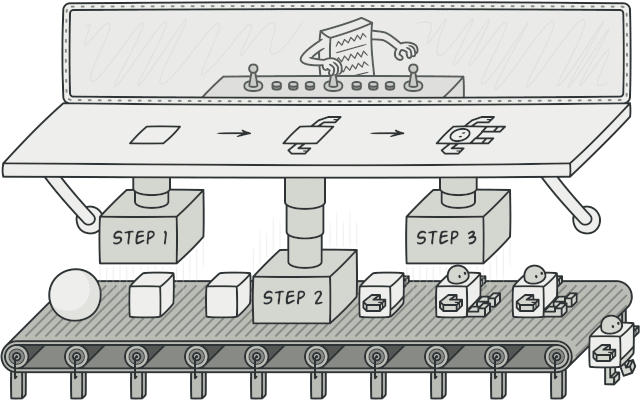
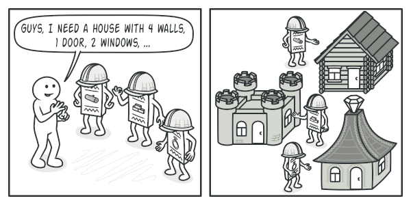
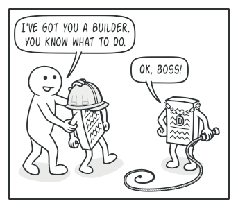
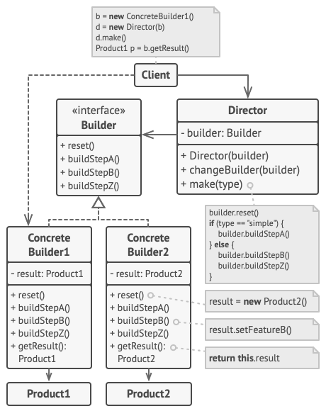

# Builder

## Περιγραφή

Το Builder είναι ένα δημιουργικό μοτίβο σχεδίασης που σας επιτρέπει να κατασκευάζετε πολύπλοκα αντικείμενα βήμα προς βήμα. Το μοτίβο επιτρέπει τη δημιουργία διαφορετικών τύπων και αναπαραστάσεων ενός αντικειμένου χρησιμοποιώντας τον ίδιο κώδικα κατασκευής.

## Σκοπός

Το **Builder** είναι ένα δημιουργικό μοτίβο σχεδίασης που σας επιτρέπει να κατασκευάζετε πολύπλοκα αντικείμενα βήμα προς βήμα. Το μοτίβο επιτρέπει τη δημιουργία διαφορετικών τύπων και αναπαραστάσεων ενός αντικειμένου χρησιμοποιώντας τον ίδιο κώδικα κατασκευής.



## Πρόβλημα

Φανταστείτε ένα πολύπλοκο αντικείμενο που απαιτεί κοπιαστική, βήμα προς βήμα αρχικοποίηση πολλών πεδίων και ενσωματωμένων αντικειμένων. Αυτός ο κώδικας αρχικοποίησης συνήθως βρίσκεται κρυμμένος σε έναν τεράστιο constructor με πολλές παραμέτρους ή, ακόμα χειρότερα, διασκορπισμένος σε όλο τον κώδικα του πελάτη.

|  | 
|:--:| 
| *Θα μπορούσατε να κάνετε το πρόγραμμα πολύ περίπλοκο δημιουργώντας μια υποκλάση για κάθε πιθανή διαμόρφωση ενός αντικειμένου.* |

Η δημιουργία μιας υποκλάσης για κάθε πιθανή διαμόρφωση ενός αντικειμένου μπορεί να κάνει το πρόγραμμα υπερβολικά πολύπλοκο.

Για παράδειγμα, σκεφτείτε πώς να δημιουργήσετε ένα αντικείμενο `House`. Για να κατασκευάσετε ένα απλό σπίτι, χρειάζεται να φτιάξετε τέσσερις τοίχους και ένα πάτωμα, να τοποθετήσετε μια πόρτα, να τοποθετήσετε δύο παράθυρα και να χτίσετε μια στέγη. Αλλά τι γίνεται αν θέλετε ένα μεγαλύτερο, φωτεινότερο σπίτι, με κήπο και άλλες παροχές (όπως σύστημα θέρμανσης, υδραυλική εγκατάσταση και ηλεκτρική καλωδίωση);

Η απλούστερη λύση είναι να επεκτείνετε την κλάση `House` και να δημιουργήσετε ένα σύνολο υποκλάσεων για να καλύψετε όλους τους συνδυασμούς των παραμέτρων. Ωστόσο, αυτό θα οδηγήσει τελικά σε μεγάλο αριθμό υποκλάσεων. Οποιαδήποτε νέα παράμετρος, όπως το στυλ της βεράντας, θα απαιτεί την επέκταση αυτής της ιεραρχίας ακόμα περισσότερο.

Υπάρχει μια άλλη προσέγγιση που δεν περιλαμβάνει τη δημιουργία υποκλάσεων. Μπορείτε να δημιουργήσετε έναν τεράστιο κατασκευαστή απευθείας στην βασική κλάση `House` με όλες τις πιθανές παραμέτρους που ελέγχουν το αντικείμενο του σπιτιού. Παρόλο που αυτή η προσέγγιση εξαλείφει την ανάγκη για υποκλάσεις, δημιουργεί άλλο πρόβλημα.

|  | 
|:--:| 
| *Ο κατασκευαστής με πολλές παραμέτρους έχει το μειονέκτημά του: δεν χρειάζονται πάντα όλες οι παράμετροι.* |

Στις περισσότερες περιπτώσεις οι περισσότερες από τις παραμέτρους θα είναι αχρησιμοποίητες, καθιστώντας τις [κλήσεις του κατασκευαστή αρκετά άσχημες](https://refactoring.guru/smells/long-parameter-list). Για παράδειγμα, μόνο ένα κλάσμα των σπιτιών διαθέτει πισίνες, οπότε οι παράμετροι που σχετίζονται με τις πισίνες θα είναι άχρηστες εννέα φορές στις δέκα.

## Λύση

Το μοτίβο Builder προτείνει να αποσπάσετε τον κώδικα κατασκευής του αντικειμένου από την ίδια την κλάση του και να τον μεταφέρετε σε ξεχωριστά αντικείμενα που ονομάζονται _builders_.

|  | 
|:--:| 
| *Το πρότυπο Builder σας επιτρέπει να κατασκευάζετε σύνθετα αντικείμενα βήμα προς βήμα. Το πρότυπο Builder δεν επιτρέπει σε άλλα αντικείμενα να έχουν πρόσβαση στο προϊόν κατά τη διάρκεια της κατασκευής του.* |

Το Builder οργανώνει την κατασκευή του αντικειμένου σε ένα σύνολο βημάτων (`buildWalls`, `buildDoor`, κ.λπ.). Για να δημιουργήσετε ένα αντικείμενο, εκτελείτε μια σειρά από αυτά τα βήματα σε ένα αντικείμενο builder. Το σημαντικό είναι ότι δεν χρειάζεται να καλέσετε όλα τα βήματα. Μπορείτε να καλέσετε μόνο αυτά που είναι απαραίτητα για να παραχθεί μια συγκεκριμένη διαμόρφωση ενός αντικειμένου.

Μερικά από τα βήματα κατασκευής μπορεί να απαιτούν διαφορετική υλοποίηση όταν χρειάζεται να κατασκευάσετε διάφορες αναπαραστάσεις του προϊόντος. Για παράδειγμα, οι τοίχοι ενός ξύλινου σπιτιού μπορεί να κατασκευαστούν από ξύλο, αλλά οι τοίχοι ενός κάστρου πρέπει να κατασκευαστούν από πέτρα.

Σε αυτή την περίπτωση, μπορείτε να δημιουργήσετε διάφορες κλάσεις builder που υλοποιούν το ίδιο σύνολο βημάτων κατασκευής, αλλά με διαφορετικό τρόπο. Στη συνέχεια, μπορείτε να χρησιμοποιήσετε αυτούς τους builders στη διαδικασία κατασκευής για να παράγετε διαφορετικά είδη αντικειμένων.

|  | 
|:--:| 
| *Διαφορετικοί κατασκευαστές εκτελούν την ίδια εργασία με διάφορους τρόπους.* |

Για παράδειγμα, φανταστείτε έναν οικοδόμο που κατασκευάζει τα πάντα από ξύλο και γυαλί, έναν δεύτερο που κατασκευάζει τα πάντα με πέτρα και σίδηρο και έναν τρίτο που χρησιμοποιεί χρυσό και διαμάντια. Καλώντας την ίδια σειρά βημάτων, παίρνετε ένα κανονικό σπίτι από τον πρώτο οικοδόμο, ένα μικρό κάστρο από τον δεύτερο και ένα παλάτι από τον τρίτο. Ωστόσο, αυτό θα μπορούσε να λειτουργήσει μόνο αν ο κώδικας του πελάτη που καλεί τα βήματα δόμησης είναι σε θέση να αλληλεπιδρά με τους κατασκευαστές χρησιμοποιώντας μια κοινή διεπαφή.

## Διευθυντής (Director)

Μπορείτε να προχωρήσετε περαιτέρω και να αποσπάσετε μια σειρά από κλήσεις στα βήματα του builder που χρησιμοποιείτε για την κατασκευή ενός προϊόντος σε μια ξεχωριστή κλάση που ονομάζεται _director_. Η κλάση director ορίζει τη σειρά εκτέλεσης των βημάτων κατασκευής, ενώ ο builder παρέχει την υλοποίηση αυτών των βημάτων.

|  | 
|:--:| 
| *Ο σκηνοθέτης γνωρίζει ποια βήματα οικοδόμησης πρέπει να εκτελέσει για να αποκτήσει ένα λειτουργικό προϊόν.* |

Η ύπαρξη μιας κλάσης director στο πρόγραμμά σας δεν είναι απολύτως απαραίτητη. Μπορείτε πάντα να καλέσετε τα βήματα δόμησης με συγκεκριμένη σειρά απευθείας από τον κώδικα του πελάτη. Ωστόσο, η κλάση director μπορεί να είναι ένα καλό μέρος για να τοποθετήσετε διάφορες ρουτίνες κατασκευής, ώστε να μπορείτε να τις επαναχρησιμοποιήσετε σε όλο το πρόγραμμά σας. 

Επιπλέον, η κλάση director κρύβει εντελώς τις λεπτομέρειες της κατασκευής του προϊόντος από τον κώδικα πελάτη. Ο πελάτης χρειάζεται μόνο να συσχετίσει έναν οικοδόμο με έναν διευθυντή, να ξεκινήσει την κατασκευή με τον διευθυντή και να πάρει το αποτέλεσμα από τον οικοδόμο.

## Δομή



1. Η διεπαφή **Builder** δηλώνει τα βήματα κατασκευής προϊόντων που είναι κοινά για όλους τους τύπους builder.   
2. Οι **Concrete Builders** παρέχουν διαφορετικές υλοποιήσεις των βημάτων κατασκευής. Οι builder σκυροδέματος ενδέχεται να παράγουν προϊόντα που δεν ακολουθούν την κοινή διεπαφή.   
3. Τα **προϊόντα** είναι αντικείμενα που προκύπτουν. Τα προϊόντα που κατασκευάζονται από διαφορετικούς κατασκευαστές δεν χρειάζεται να ανήκουν στην ίδια ιεραρχία κλάσεων ή διεπαφή.   
4. Η κλάση **Director** ορίζει τη σειρά κλήσης των βημάτων κατασκευής, ώστε να μπορείτε να δημιουργείτε και να επαναχρησιμοποιείτε συγκεκριμένες διαμορφώσεις προϊόντων.   
5. Ο **Πελάτης** πρέπει να συσχετίσει ένα από τα αντικείμενα του builder με τον διευθυντή. Συνήθως, αυτό γίνεται μόνο μία φορά, μέσω των παραμέτρων του κατασκευαστή του διευθυντή. Στη συνέχεια, ο διευθυντής χρησιμοποιεί αυτό το αντικείμενο builder για όλες τις περαιτέρω κατασκευές. Ωστόσο, υπάρχει μια εναλλακτική προσέγγιση για την περίπτωση που ο πελάτης μεταβιβάζει το αντικείμενο builder στη μέθοδο παραγωγής του διευθυντή. Σε αυτή την περίπτωση, μπορείτε να χρησιμοποιείτε έναν διαφορετικό builder κάθε φορά που παράγετε κάτι με τον διευθυντή.

## Ψευδοκώδικας

Αυτό το παράδειγμα του **Builder** pattern απεικονίζει πώς μπορείτε να επαναχρησιμοποιήσετε τον ίδιο κώδικα κατασκευής αντικειμένων κατά την κατασκευή διαφορετικών τύπων προϊόντων, όπως αυτοκίνητα, και να δημιουργήσετε τα αντίστοιχα εγχειρίδια για αυτά.

|  | 
|:--:| 
| *Το παράδειγμα της βήμα-βήμα κατασκευής αυτοκινήτων και των εγχειριδίων χρήστη που αντιστοιχούν σε αυτά τα μοντέλα αυτοκινήτων.* |

Ένα αυτοκίνητο είναι ένα σύνθετο αντικείμενο που μπορεί να κατασκευαστεί με εκατό διαφορετικούς τρόπους. Αντί να φορτώσουμε την κλάση `Car` με έναν τεράστιο constructor, εξαγάγαμε τον κώδικα συναρμολόγησης του αυτοκινήτου σε μια ξεχωριστή κλάση builder αυτοκινήτων. Αυτή η κλάση διαθέτει μια σειρά από μεθόδους για τη διαμόρφωση διαφόρων μερών ενός αυτοκινήτου.

Αν ο κώδικας πελάτη χρειάζεται να συναρμολογήσει ένα ειδικό, καλορυθμισμένο μοντέλο αυτοκινήτου, μπορεί να συνεργαστεί απευθείας με τον builder. Από την άλλη πλευρά, ο πελάτης μπορεί να αναθέσει τη συναρμολόγηση σε μια κλάση διευθυντή (director), η οποία γνωρίζει πώς να χρησιμοποιήσει έναν builder για να κατασκευάσει αρκετά από τα πιο δημοφιλή μοντέλα αυτοκινήτων.

Μπορεί να σας σοκάρει, αλλά κάθε αυτοκίνητο χρειάζεται ένα εγχειρίδιο (σοβαρά, ποιος τα διαβάζει;). Το εγχειρίδιο περιγράφει κάθε χαρακτηριστικό του αυτοκινήτου, οπότε οι λεπτομέρειες στα εγχειρίδια διαφέρουν μεταξύ των διαφορετικών μοντέλων. Γι' αυτό έχει νόημα να επαναχρησιμοποιηθεί μια υπάρχουσα διαδικασία κατασκευής τόσο για τα πραγματικά αυτοκίνητα όσο και για τα αντίστοιχα εγχειρίδια τους. Φυσικά, η κατασκευή ενός εγχειριδίου δεν είναι ίδια με την κατασκευή ενός αυτοκινήτου, και γι' αυτό πρέπει να παρέχουμε μια άλλη κλάση builder που ειδικεύεται στη σύνθεση εγχειριδίων. Αυτή η κλάση υλοποιεί τις ίδιες μεθόδους κατασκευής με τον builder αυτοκινήτων, αλλά αντί να κατασκευάζει μέρη αυτοκινήτων, τα περιγράφει. Δίνοντας αυτούς τους builders στο ίδιο αντικείμενο director, μπορούμε να κατασκευάσουμε είτε ένα αυτοκίνητο είτε ένα εγχειρίδιο.

Το τελευταίο μέρος είναι η ανάκτηση του τελικού αντικειμένου. Ένα μεταλλικό αυτοκίνητο και ένα χάρτινο εγχειρίδιο, παρόλο που σχετίζονται, είναι ακόμα πολύ διαφορετικά πράγματα. Δεν μπορούμε να τοποθετήσουμε μια μέθοδο ανάκτησης αποτελεσμάτων στον director χωρίς να τον συσχετίσουμε με συγκεκριμένες κλάσεις προϊόντων. Επομένως, λαμβάνουμε το αποτέλεσμα της κατασκευής από τον builder που έκανε τη δουλειά.

```
// Using the Builder pattern makes sense only when your products
// are quite complex and require extensive configuration. The
// following two products are related, although they don't have
// a common interface.
class Car is
    // A car can have a GPS, trip computer and some number of
    // seats. Different models of cars (sports car, SUV,
    // cabriolet) might have different features installed or
    // enabled.

class Manual is
    // Each car should have a user manual that corresponds to
    // the car's configuration and describes all its features.


// The builder interface specifies methods for creating the
// different parts of the product objects.
interface Builder is
    method reset()
    method setSeats(...)
    method setEngine(...)
    method setTripComputer(...)
    method setGPS(...)

// The concrete builder classes follow the builder interface and
// provide specific implementations of the building steps. Your
// program may have several variations of builders, each
// implemented differently.
class CarBuilder implements Builder is
    private field car:Car

    // A fresh builder instance should contain a blank product
    // object which it uses in further assembly.
    constructor CarBuilder() is
        this.reset()

    // The reset method clears the object being built.
    method reset() is
        this.car = new Car()

    // All production steps work with the same product instance.
    method setSeats(...) is
        // Set the number of seats in the car.

    method setEngine(...) is
        // Install a given engine.

    method setTripComputer(...) is
        // Install a trip computer.

    method setGPS(...) is
        // Install a global positioning system.

    // Concrete builders are supposed to provide their own
    // methods for retrieving results. That's because various
    // types of builders may create entirely different products
    // that don't all follow the same interface. Therefore such
    // methods can't be declared in the builder interface (at
    // least not in a statically-typed programming language).
    //
    // Usually, after returning the end result to the client, a
    // builder instance is expected to be ready to start
    // producing another product. That's why it's a usual
    // practice to call the reset method at the end of the
    // `getProduct` method body. However, this behavior isn't
    // mandatory, and you can make your builder wait for an
    // explicit reset call from the client code before disposing
    // of the previous result.
    method getProduct():Car is
        product = this.car
        this.reset()
        return product

// Unlike other creational patterns, builder lets you construct
// products that don't follow the common interface.
class CarManualBuilder implements Builder is
    private field manual:Manual

    constructor CarManualBuilder() is
        this.reset()

    method reset() is
        this.manual = new Manual()

    method setSeats(...) is
        // Document car seat features.

    method setEngine(...) is
        // Add engine instructions.

    method setTripComputer(...) is
        // Add trip computer instructions.

    method setGPS(...) is
        // Add GPS instructions.

    method getProduct():Manual is
        // Return the manual and reset the builder.


// The director is only responsible for executing the building
// steps in a particular sequence. It's helpful when producing
// products according to a specific order or configuration.
// Strictly speaking, the director class is optional, since the
// client can control builders directly.
class Director is
    // The director works with any builder instance that the
    // client code passes to it. This way, the client code may
    // alter the final type of the newly assembled product.
    // The director can construct several product variations
    // using the same building steps.
    method constructSportsCar(builder: Builder) is
        builder.reset()
        builder.setSeats(2)
        builder.setEngine(new SportEngine())
        builder.setTripComputer(true)
        builder.setGPS(true)

    method constructSUV(builder: Builder) is
        // ...


// The client code creates a builder object, passes it to the
// director and then initiates the construction process. The end
// result is retrieved from the builder object.
class Application is

    method makeCar() is
        director = new Director()

        CarBuilder builder = new CarBuilder()
        director.constructSportsCar(builder)
        Car car = builder.getProduct()

        CarManualBuilder builder = new CarManualBuilder()
        director.constructSportsCar(builder)

        // The final product is often retrieved from a builder
        // object since the director isn't aware of and not
        // dependent on concrete builders and products.
        Manual manual = builder.getProduct()
```

## Εφαρμοσιμότητα

* **Χρησιμοποιήστε το μοτίβο Builder για να απαλλαγείτε από έναν "τηλεσκοπικό κατασκευαστή".**

Ας υποθέσουμε ότι έχετε έναν κατασκευαστή με δέκα προαιρετικές παραμέτρους. Η κλήση ενός τέτοιου κατασκευαστή είναι εξαιρετικά άβολη. Γι' αυτό, υπερφορτώνετε τον κατασκευαστή και δημιουργείτε αρκετές μικρότερες εκδόσεις με λιγότερες παραμέτρους. Αυτοί οι κατασκευαστές παραπέμπουν στον κύριο κατασκευαστή, περνώντας κάποιες προεπιλεγμένες τιμές για οποιεσδήποτε παραλειπόμενες παραμέτρους.

```java
class Pizza {
    Pizza(int size) { ... }
    Pizza(int size, boolean cheese) { ... }
    Pizza(int size, boolean cheese, boolean pepperoni) { ... }
    // ...
}
```
Η δημιουργία ενός τέτοιου "τέρατος" είναι δυνατή μόνο σε γλώσσες που υποστηρίζουν την υπερφόρτωση μεθόδων, όπως η C# ή η Java.

Το μοτίβο Builder σας επιτρέπει να κατασκευάζετε αντικείμενα βήμα προς βήμα, χρησιμοποιώντας μόνο τα απαραίτητα βήματα. Μετά την υλοποίηση του μοτίβου, δεν χρειάζεται πλέον να γεμίζετε τους κατασκευαστές με δεκάδες παραμέτρους.

* **Χρησιμοποιήστε το μοτίβο Builder όταν θέλετε ο κώδικάς σας να μπορεί να δημιουργήσει διαφορετικές αναπαραστάσεις ενός προϊόντος (για παράδειγμα, πέτρινα και ξύλινα σπίτια).**

Το μοτίβο Builder μπορεί να εφαρμοστεί όταν η κατασκευή διαφόρων αναπαραστάσεων του προϊόντος περιλαμβάνει παρόμοια βήματα που διαφέρουν μόνο στις λεπτομέρειες.

Η βασική διεπαφή του builder ορίζει όλα τα δυνατά βήματα κατασκευής, και οι συγκεκριμένοι builders υλοποιούν αυτά τα βήματα για να κατασκευάσουν συγκεκριμένες αναπαραστάσεις του προϊόντος. Εν τω μεταξύ, η κλάση director καθοδηγεί τη σειρά κατασκευής.

* **Χρησιμοποιήστε το Builder για να κατασκευάσετε [Composite](https://refactoring.guru/design-patterns/composite) δέντρα ή άλλα πολύπλοκα αντικείμενα.**

Το μοτίβο Builder σας επιτρέπει να κατασκευάζετε προϊόντα βήμα προς βήμα. Μπορείτε να αναβάλετε την εκτέλεση ορισμένων βημάτων χωρίς να διακόψετε το τελικό προϊόν. Μπορείτε ακόμη και να καλέσετε βήματα αναδρομικά, κάτι που είναι χρήσιμο όταν χρειάζεται να κατασκευάσετε ένα δέντρο αντικειμένων.

Ένας builder δεν εκθέτει το μη ολοκληρωμένο προϊόν κατά την εκτέλεση των βημάτων κατασκευής. Αυτό εμποδίζει τον κώδικα-πελάτη να αποκτήσει ένα μη ολοκληρωμένο αποτέλεσμα.

## Πώς να Υλοποιήσετε

1.  Βεβαιωθείτε ότι μπορείτε να ορίσετε ξεκάθαρα τα κοινά βήματα κατασκευής για την κατασκευή όλων των διαθέσιμων αναπαραστάσεων του προϊόντος. Διαφορετικά, δεν θα μπορέσετε να προχωρήσετε με την υλοποίηση του μοτίβου.   
    
2.  Δηλώστε αυτά τα βήματα στη βασική διεπαφή του builder.   
    
3.  Δημιουργήστε μία συγκεκριμένη κλάση builder για κάθε αναπαράσταση του προϊόντος και υλοποιήστε τα βήματα κατασκευής της.   
    
    Μην ξεχάσετε να υλοποιήσετε μια μέθοδο για την απόκτηση του αποτελέσματος της κατασκευής. Ο λόγος που αυτή η μέθοδος δεν μπορεί να δηλωθεί στη βασική διεπαφή του builder είναι ότι διάφοροι builders μπορεί να κατασκευάζουν προϊόντα που δεν έχουν κοινή διεπαφή. Επομένως, δεν γνωρίζετε ποιος θα είναι ο τύπος επιστροφής μιας τέτοιας μεθόδου. Ωστόσο, αν ασχολείστε με προϊόντα από μία ενιαία ιεραρχία, η μέθοδος απόκτησης μπορεί να προστεθεί με ασφάλεια στη βασική διεπαφή.   
    
4.  Σκεφτείτε να δημιουργήσετε μια κλάση director. Μπορεί να ενσωματώσει διάφορους τρόπους κατασκευής ενός προϊόντος χρησιμοποιώντας το ίδιο αντικείμενο builder.   
    
5.  Ο κώδικας-πελάτης δημιουργεί τόσο τον builder όσο και τον director. Πριν ξεκινήσει η κατασκευή, ο πελάτης πρέπει να περάσει ένα αντικείμενο builder στον director. Συνήθως, ο πελάτης το κάνει αυτό μόνο μία φορά, μέσω παραμέτρων του κατασκευαστή της κλάσης director. Ο director χρησιμοποιεί το αντικείμενο builder σε όλη την περαιτέρω κατασκευή. Υπάρχει μια εναλλακτική προσέγγιση, όπου ο builder περνιέται σε μια συγκεκριμένη μέθοδο κατασκευής προϊόντος του director.   
    
6.  Το αποτέλεσμα της κατασκευής μπορεί να αποκτηθεί άμεσα από τον director μόνο αν όλα τα προϊόντα ακολουθούν την ίδια διεπαφή. Διαφορετικά, ο πελάτης πρέπει να αποκτήσει το αποτέλεσμα από τον builder.   

## Πλεονεκτήματα και Μειονεκτήματα

### Πλεονεκτήματα
*   Μπορείτε να κατασκευάζετε αντικείμενα βήμα προς βήμα, να αναβάλλετε βήματα κατασκευής ή να εκτελείτε βήματα αναδρομικά.   
*   Μπορείτε να επαναχρησιμοποιήσετε τον ίδιο κώδικα κατασκευής κατά την κατασκευή διαφόρων αναπαραστάσεων προϊόντων.   
*   _Αρχή Μοναδικής Ευθύνης_. Μπορείτε να απομονώσετε τον πολύπλοκο κώδικα κατασκευής από τη λογική του προϊόντος.   

### Μειονεκτήματα
*   Η συνολική πολυπλοκότητα του κώδικα αυξάνεται καθώς το μοτίβο απαιτεί τη δημιουργία πολλών νέων κλάσεων.

## Σχέσεις με Άλλα Μοτίβα

*   Πολλά σχέδια ξεκινούν χρησιμοποιώντας το [Factory Method](https://refactoring.guru/design-patterns/factory-method) (λιγότερο περίπλοκο και πιο προσαρμόσιμο μέσω υποκλάσεων) και εξελίσσονται προς το [Abstract Factory](https://refactoring.guru/design-patterns/abstract-factory), το [Prototype](https://refactoring.guru/design-patterns/prototype) ή το [Builder](https://refactoring.guru/design-patterns/builder) (πιο ευέλικτο, αλλά πιο περίπλοκο).
    
*   Το [Builder](https://refactoring.guru/design-patterns/builder) επικεντρώνεται στην κατασκευή πολύπλοκων αντικειμένων βήμα προς βήμα. Το [Abstract Factory](https://refactoring.guru/design-patterns/abstract-factory) εξειδικεύεται στη δημιουργία οικογενειών σχετικών αντικειμένων. Το _Abstract Factory_ επιστρέφει το προϊόν άμεσα, ενώ το _Builder_ σας επιτρέπει να εκτελέσετε επιπλέον βήματα κατασκευής πριν αποκτήσετε το προϊόν.
    
*   Μπορείτε να χρησιμοποιήσετε το [Builder](https://refactoring.guru/design-patterns/builder) όταν δημιουργείτε πολύπλοκα [Composite](https://refactoring.guru/design-patterns/composite) δέντρα, επειδή μπορείτε να προγραμματίσετε τα βήματα κατασκευής του να λειτουργούν αναδρομικά.
    
*   Μπορείτε να συνδυάσετε το [Builder](https://refactoring.guru/design-patterns/builder) με το [Bridge](https://refactoring.guru/design-patterns/bridge): η κλάση director παίζει τον ρόλο της αφαίρεσης, ενώ διαφορετικοί builders λειτουργούν ως υλοποιήσεις.
    
*   Τα [Abstract Factories](https://refactoring.guru/design-patterns/abstract-factory), οι [Builders](https://refactoring.guru/design-patterns/builder) και τα [Prototypes](https://refactoring.guru/design-patterns/prototype) μπορούν όλα να υλοποιηθούν ως [Singletons](https://refactoring.guru/design-patterns/singleton).

---


# Builder στην Java

**Περιγραφή:** Το μοτίβο Builder στην Java. Πλήρες παράδειγμα κώδικα στο Java με λεπτομερή σχόλια και επεξήγηση. Το Builder είναι ένα μοτίβο δημιουργίας, το οποίο επιτρέπει την κατασκευή σύνθετων αντικειμένων βήμα προς βήμα.

Το **Builder** είναι ένα μοτίβο δημιουργίας, το οποίο επιτρέπει την κατασκευή σύνθετων αντικειμένων βήμα προς βήμα.

Σε αντίθεση με άλλα μοτίβα δημιουργίας, το Builder δεν απαιτεί τα προϊόντα να έχουν μια κοινή διεπαφή. Αυτό καθιστά δυνατή την παραγωγή διαφορετικών προϊόντων χρησιμοποιώντας την ίδια διαδικασία κατασκευής.

## **Παραδείγματα χρήσης:** 

Το μοτίβο Builder είναι ένα γνωστό μοτίβο στον κόσμο της Java. Είναι ιδιαίτερα χρήσιμο όταν χρειάζεται να δημιουργηθεί ένα αντικείμενο με πολλές πιθανές επιλογές διαμόρφωσης.

Το Builder χρησιμοποιείται ευρέως στις βασικές βιβλιοθήκες του Java:

- [java.lang.StringBuilder#append()](http://docs.oracle.com/javase/8/docs/api/java/lang/StringBuilder.html#append-boolean-) (`unsynchronized`)   
- [java.lang.StringBuffer#append()](http://docs.oracle.com/javase/8/docs/api/java/lang/StringBuffer.html#append-boolean-) (`synchronized`)    
- [java.nio.ByteBuffer#put()](http://docs.oracle.com/javase/8/docs/api/java/nio/ByteBuffer.html#put-byte-) (επίσης στις [CharBuffer](http://docs.oracle.com/javase/8/docs/api/java/nio/CharBuffer.html#put-char-), [ShortBuffer]](http://docs.oracle.com/javase/8/docs/api/java/nio/ShortBuffer.html#put-short-), [IntBuffer]](http://docs.oracle.com/javase/8/docs/api/java/nio/IntBuffer.html#put-int-), [LongBuffer](http://docs.oracle.com/javase/8/docs/api/java/nio/LongBuffer.html#put-long-), [FloatBuffer](http://docs.oracle.com/javase/8/docs/api/java/nio/FloatBuffer.html#put-float-) και [DoubleBuffer](http://docs.oracle.com/javase/8/docs/api/java/nio/DoubleBuffer.html#put-double-))   
- [javax.swing.GroupLayout.Group#addComponent()](http://docs.oracle.com/javase/8/docs/api/javax/swing/GroupLayout.Group.html#addComponent-java.awt.Component-)   
- Όλες οι υλοποιήσεις του [java.lang.Appendable](http://docs.oracle.com/javase/8/docs/api/java/lang/Appendable.html)   

**Ταυτοποίηση**: Το μοτίβο Builder μπορεί να αναγνωριστεί σε μια κλάση που έχει μία μέθοδο δημιουργίας και πολλές μεθόδους για τη διαμόρφωση του τελικού αντικειμένου. Οι μέθοδοι του Builder συχνά υποστηρίζουν αλυσίδες (π.χ., `someBuilder.setValueA(1).setValueB(2).create()`).

## Παραγωγή αυτοκινήτου βήμα προς βήμα

Σε αυτό το παράδειγμα, το μοτίβο Builder επιτρέπει την κατασκευή διαφορετικών μοντέλων αυτοκινήτων βήμα προς βήμα.

Το παράδειγμα δείχνει επίσης πώς το Builder παράγει προϊόντα διαφορετικών τύπων (π.χ., εγχειρίδιο αυτοκινήτου) χρησιμοποιώντας τα ίδια βήματα κατασκευής.

Ο **Director** ελέγχει τη σειρά της κατασκευής. Γνωρίζει ποια βήματα κατασκευής να καλέσει για να παράγει ένα συγκεκριμένο μοντέλο αυτοκινήτου. Λειτουργεί με τους builders μόνο μέσω της κοινής τους διεπαφής. Αυτό επιτρέπει τη μετάβαση διαφορετικών τύπων builders στον director.

Το τελικό αποτέλεσμα ανακτάται από το αντικείμενο του builder, επειδή ο director δεν μπορεί να γνωρίζει τον τύπο του τελικού προϊόντος. Μόνο το αντικείμενο του Builder γνωρίζει τι ακριβώς κατασκευάζει.

### builders

* **builders/Builder.java**: Κοινή διεπαφή κατασκευαστή
```java
package refactoring_guru.builder.example.builders;

import refactoring_guru.builder.example.cars.CarType;
import refactoring_guru.builder.example.components.Engine;
import refactoring_guru.builder.example.components.GPSNavigator;
import refactoring_guru.builder.example.components.Transmission;
import refactoring_guru.builder.example.components.TripComputer;

/**
 * Builder interface defines all possible ways to configure a product.
 */
public interface Builder {
    void setCarType(CarType type);
    void setSeats(int seats);
    void setEngine(Engine engine);
    void setTransmission(Transmission transmission);
    void setTripComputer(TripComputer tripComputer);
    void setGPSNavigator(GPSNavigator gpsNavigator);
}
```

* **builders/CarBuilder.java**: Builder του car
```java
package refactoring_guru.builder.example.builders;

import refactoring_guru.builder.example.cars.Car;
import refactoring_guru.builder.example.cars.CarType;
import refactoring_guru.builder.example.components.Engine;
import refactoring_guru.builder.example.components.GPSNavigator;
import refactoring_guru.builder.example.components.Transmission;
import refactoring_guru.builder.example.components.TripComputer;

/**
 * Concrete builders implement steps defined in the common interface.
 */
public class CarBuilder implements Builder {
    private CarType type;
    private int seats;
    private Engine engine;
    private Transmission transmission;
    private TripComputer tripComputer;
    private GPSNavigator gpsNavigator;

    public void setCarType(CarType type) {
        this.type = type;
    }

    @Override
    public void setSeats(int seats) {
        this.seats = seats;
    }

    @Override
    public void setEngine(Engine engine) {
        this.engine = engine;
    }

    @Override
    public void setTransmission(Transmission transmission) {
        this.transmission = transmission;
    }

    @Override
    public void setTripComputer(TripComputer tripComputer) {
        this.tripComputer = tripComputer;
    }

    @Override
    public void setGPSNavigator(GPSNavigator gpsNavigator) {
        this.gpsNavigator = gpsNavigator;
    }

    public Car getResult() {
        return new Car(type, seats, engine, transmission, tripComputer, gpsNavigator);
    }
}
```

* **builders/CarManualBuilder.java**: Builder of a car manual
```java
package refactoring_guru.builder.example.builders;

import refactoring_guru.builder.example.cars.Manual;
import refactoring_guru.builder.example.cars.CarType;
import refactoring_guru.builder.example.components.Engine;
import refactoring_guru.builder.example.components.GPSNavigator;
import refactoring_guru.builder.example.components.Transmission;
import refactoring_guru.builder.example.components.TripComputer;

/**
 * Unlike other creational patterns, Builder can construct unrelated products,
 * which don't have the common interface.
 *
 * In this case we build a user manual for a car, using the same steps as we
 * built a car. This allows to produce manuals for specific car models,
 * configured with different features.
 */
public class CarManualBuilder implements Builder{
    private CarType type;
    private int seats;
    private Engine engine;
    private Transmission transmission;
    private TripComputer tripComputer;
    private GPSNavigator gpsNavigator;

    @Override
    public void setCarType(CarType type) {
        this.type = type;
    }

    @Override
    public void setSeats(int seats) {
        this.seats = seats;
    }

    @Override
    public void setEngine(Engine engine) {
        this.engine = engine;
    }

    @Override
    public void setTransmission(Transmission transmission) {
        this.transmission = transmission;
    }

    @Override
    public void setTripComputer(TripComputer tripComputer) {
        this.tripComputer = tripComputer;
    }

    @Override
    public void setGPSNavigator(GPSNavigator gpsNavigator) {
        this.gpsNavigator = gpsNavigator;
    }

    public Manual getResult() {
        return new Manual(type, seats, engine, transmission, tripComputer, gpsNavigator);
    }
}
```

### cars

* **cars/Car.java**: Car product
```java
package refactoring_guru.builder.example.cars;

import refactoring_guru.builder.example.components.Engine;
import refactoring_guru.builder.example.components.GPSNavigator;
import refactoring_guru.builder.example.components.Transmission;
import refactoring_guru.builder.example.components.TripComputer;

/**
 * Car is a product class.
 */
public class Car {
    private final CarType carType;
    private final int seats;
    private final Engine engine;
    private final Transmission transmission;
    private final TripComputer tripComputer;
    private final GPSNavigator gpsNavigator;
    private double fuel = 0;

    public Car(CarType carType, int seats, Engine engine, Transmission transmission,
               TripComputer tripComputer, GPSNavigator gpsNavigator) {
        this.carType = carType;
        this.seats = seats;
        this.engine = engine;
        this.transmission = transmission;
        this.tripComputer = tripComputer;
        if (this.tripComputer != null) {
            this.tripComputer.setCar(this);
        }
        this.gpsNavigator = gpsNavigator;
    }

    public CarType getCarType() {
        return carType;
    }

    public double getFuel() {
        return fuel;
    }

    public void setFuel(double fuel) {
        this.fuel = fuel;
    }

    public int getSeats() {
        return seats;
    }

    public Engine getEngine() {
        return engine;
    }

    public Transmission getTransmission() {
        return transmission;
    }

    public TripComputer getTripComputer() {
        return tripComputer;
    }

    public GPSNavigator getGpsNavigator() {
        return gpsNavigator;
    }
}
```

* **cars/Manual.java**: Manual product
```java
package refactoring_guru.builder.example.cars;

import refactoring_guru.builder.example.components.Engine;
import refactoring_guru.builder.example.components.GPSNavigator;
import refactoring_guru.builder.example.components.Transmission;
import refactoring_guru.builder.example.components.TripComputer;

/**
 * Car manual is another product. Note that it does not have the same ancestor
 * as a Car. They are not related.
 */
public class Manual {
    private final CarType carType;
    private final int seats;
    private final Engine engine;
    private final Transmission transmission;
    private final TripComputer tripComputer;
    private final GPSNavigator gpsNavigator;

    public Manual(CarType carType, int seats, Engine engine, Transmission transmission,
                  TripComputer tripComputer, GPSNavigator gpsNavigator) {
        this.carType = carType;
        this.seats = seats;
        this.engine = engine;
        this.transmission = transmission;
        this.tripComputer = tripComputer;
        this.gpsNavigator = gpsNavigator;
    }

    public String print() {
        String info = "";
        info += "Type of car: " + carType + "\n";
        info += "Count of seats: " + seats + "\n";
        info += "Engine: volume - " + engine.getVolume() + "; mileage - " + engine.getMileage() + "\n";
        info += "Transmission: " + transmission + "\n";
        if (this.tripComputer != null) {
            info += "Trip Computer: Functional" + "\n";
        } else {
            info += "Trip Computer: N/A" + "\n";
        }
        if (this.gpsNavigator != null) {
            info += "GPS Navigator: Functional" + "\n";
        } else {
            info += "GPS Navigator: N/A" + "\n";
        }
        return info;
    }
}
```

* **cars/CarType.java**
```java
package refactoring_guru.builder.example.cars;

public enum CarType {
    CITY_CAR, SPORTS_CAR, SUV
}
```

### components

* **components/Engine.java**: Product feature 1
```java
package refactoring_guru.builder.example.components;

/**
 * Just another feature of a car.
 */
public class Engine {
    private final double volume;
    private double mileage;
    private boolean started;

    public Engine(double volume, double mileage) {
        this.volume = volume;
        this.mileage = mileage;
    }

    public void on() {
        started = true;
    }

    public void off() {
        started = false;
    }

    public boolean isStarted() {
        return started;
    }

    public void go(double mileage) {
        if (started) {
            this.mileage += mileage;
        } else {
            System.err.println("Cannot go(), you must start engine first!");
        }
    }

    public double getVolume() {
        return volume;
    }

    public double getMileage() {
        return mileage;
    }
}
```

* **components/GPSNavigator.java**: Product feature 2
```java
package refactoring_guru.builder.example.components;

/**
 * Just another feature of a car.
 */
public class GPSNavigator {
    private String route;

    public GPSNavigator() {
        this.route = "221b, Baker Street, London  to Scotland Yard, 8-10 Broadway, London";
    }

    public GPSNavigator(String manualRoute) {
        this.route = manualRoute;
    }

    public String getRoute() {
        return route;
    }
}
```

* **components/Transmission.java**: Product feature 3
```java
package refactoring_guru.builder.example.components;

/**
 * Just another feature of a car.
 */
public enum Transmission {
    SINGLE_SPEED, MANUAL, AUTOMATIC, SEMI_AUTOMATIC
}
 components/TripComputer.java: Product feature 4
package refactoring_guru.builder.example.components;

import refactoring_guru.builder.example.cars.Car;

/**
 * Just another feature of a car.
 */
public class TripComputer {

    private Car car;

    public void setCar(Car car) {
        this.car = car;
    }

    public void showFuelLevel() {
        System.out.println("Fuel level: " + car.getFuel());
    }

    public void showStatus() {
        if (this.car.getEngine().isStarted()) {
            System.out.println("Car is started");
        } else {
            System.out.println("Car isn't started");
        }
    }
}
```

### director

* **director/Director.java**: Director controls builders
```java
package refactoring_guru.builder.example.director;

import refactoring_guru.builder.example.builders.Builder;
import refactoring_guru.builder.example.cars.CarType;
import refactoring_guru.builder.example.components.Engine;
import refactoring_guru.builder.example.components.GPSNavigator;
import refactoring_guru.builder.example.components.Transmission;
import refactoring_guru.builder.example.components.TripComputer;

/**
 * Director defines the order of building steps. It works with a builder object
 * through common Builder interface. Therefore it may not know what product is
 * being built.
 */
public class Director {

    public void constructSportsCar(Builder builder) {
        builder.setCarType(CarType.SPORTS_CAR);
        builder.setSeats(2);
        builder.setEngine(new Engine(3.0, 0));
        builder.setTransmission(Transmission.SEMI_AUTOMATIC);
        builder.setTripComputer(new TripComputer());
        builder.setGPSNavigator(new GPSNavigator());
    }

    public void constructCityCar(Builder builder) {
        builder.setCarType(CarType.CITY_CAR);
        builder.setSeats(2);
        builder.setEngine(new Engine(1.2, 0));
        builder.setTransmission(Transmission.AUTOMATIC);
        builder.setTripComputer(new TripComputer());
        builder.setGPSNavigator(new GPSNavigator());
    }

    public void constructSUV(Builder builder) {
        builder.setCarType(CarType.SUV);
        builder.setSeats(4);
        builder.setEngine(new Engine(2.5, 0));
        builder.setTransmission(Transmission.MANUAL);
        builder.setGPSNavigator(new GPSNavigator());
    }
}
```

### **Demo.java**: Client code
```java
package refactoring_guru.builder.example;

import refactoring_guru.builder.example.builders.CarBuilder;
import refactoring_guru.builder.example.builders.CarManualBuilder;
import refactoring_guru.builder.example.cars.Car;
import refactoring_guru.builder.example.cars.Manual;
import refactoring_guru.builder.example.director.Director;

/**
 * Demo class. Everything comes together here.
 */
public class Demo {

    public static void main(String[] args) {
        Director director = new Director();

        // Director gets the concrete builder object from the client
        // (application code). That's because application knows better which
        // builder to use to get a specific product.
        CarBuilder builder = new CarBuilder();
        director.constructSportsCar(builder);

        // The final product is often retrieved from a builder object, since
        // Director is not aware and not dependent on concrete builders and
        // products.
        Car car = builder.getResult();
        System.out.println("Car built:\n" + car.getCarType());


        CarManualBuilder manualBuilder = new CarManualBuilder();

        // Director may know several building recipes.
        director.constructSportsCar(manualBuilder);
        Manual carManual = manualBuilder.getResult();
        System.out.println("\nCar manual built:\n" + carManual.print());
    }

}
```

### OutputDemo.txt: Execution result
```
Car built:
SPORTS_CAR

Car manual built:
Type of car: SPORTS_CAR
Count of seats: 2
Engine: volume - 3.0; mileage - 0.0
Transmission: SEMI_AUTOMATIC
Trip Computer: Functional
GPS Navigator: Functional
```

---

# ΠΗΓΕΣ

- [Builder](https://refactoring.guru/design-patterns/builder)   
- [Builder in Java](https://refactoring.guru/design-patterns/builder/java/example)
