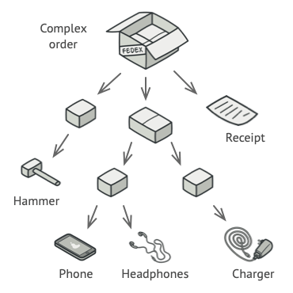

# Composite

## Σκοπός

Το Composite είναι ένα πρότυπο δομικής σχεδίασης που σας επιτρέπει να συνθέτετε αντικείμενα σε δενδρικές δομές και στη συνέχεια να εργάζεστε με αυτές τις δομές σαν να επρόκειτο για μεμονωμένα αντικείμενα.


## Πρόβλημα

Η χρήση του προτύπου Composite έχει νόημα μόνο όταν το βασικό μοντέλο της εφαρμογής σας μπορεί να αναπαρασταθεί ως δέντρο. 

Για παράδειγμα, φανταστείτε ότι έχετε δύο τύπους αντικειμένων: `Products` και `Boxes`. Ένα `Box` μπορεί να περιέχει πολλά `Products` καθώς και πολλά μικρότερα `Boxes`. Αυτά τα μικρά `Boxes` μπορούν επίσης να περιέχουν κάποια `Products` ή ακόμη μικρότερα `Boxes` κ.ο.κ. 

Ας πούμε ότι αποφασίζετε να δημιουργήσετε ένα σύστημα παραγγελιών που χρησιμοποιεί αυτές τις κλάσεις. Οι παραγγελίες θα μπορούσαν να περιέχουν απλά προϊόντα χωρίς περιτύλιγμα, καθώς και κουτιά γεμάτα με προϊόντα... και άλλα κουτιά. Πώς θα προσδιορίζατε τη συνολική τιμή μιας τέτοιας παραγγελίας;

|  | 
|:--:| 
| *Μια παραγγελία μπορεί να περιλαμβάνει διάφορα προϊόντα, συσκευασμένα σε κουτιά, τα οποία συσκευάζονται σε μεγαλύτερα κουτιά και ούτω καθεξής. Η όλη δομή μοιάζει με ένα ανάποδο δέντρο.* |

Θα μπορούσατε να δοκιμάσετε την άμεση προσέγγιση: ξετυλίξτε όλα τα κουτιά, εξετάστε όλα τα προϊόντα και, στη συνέχεια, υπολογίστε το συνολικό ποσό. Αυτό θα ήταν εφικτό στον πραγματικό κόσμο, αλλά σε ένα πρόγραμμα δεν είναι τόσο απλό όσο η εκτέλεση ενός βρόχου. Πρέπει να γνωρίζετε εκ των προτέρων τις κλάσεις `Products` και `Boxes` που περνάτε, το επίπεδο φωλιάσματος των κιβωτίων και άλλες δυσάρεστες λεπτομέρειες. Όλα αυτά καθιστούν την άμεση προσέγγιση είτε πολύ δύσκολη είτε ακόμη και αδύνατη.

## Λύση

Το πρότυπο Composite προτείνει να εργάζεστε με `Products` και `Boxes` μέσω μιας κοινής διεπαφής η οποία δηλώνει μια μέθοδο για τον υπολογισμό της συνολικής τιμής. 

Πώς θα λειτουργούσε αυτή η μέθοδος; Για ένα προϊόν, θα επέστρεφε απλώς την τιμή του προϊόντος. Για ένα κιβώτιο, θα εξετάζει κάθε στοιχείο που περιέχει το κιβώτιο, θα ζητά την τιμή του και στη συνέχεια θα επιστρέφει το συνολικό ποσό για αυτό το κιβώτιο. Εάν ένα από αυτά τα αντικείμενα ήταν ένα μικρότερο κουτί, το κουτί αυτό θα άρχιζε επίσης να εξετάζει το περιεχόμενό του και ούτω καθεξής, μέχρι να υπολογιστούν οι τιμές όλων των εσωτερικών συστατικών. Ένα κουτί θα μπορούσε ακόμη και να προσθέσει κάποιο επιπλέον κόστος στην τελική τιμή, όπως το κόστος συσκευασίας.

|  | 
|:--:| 
| *Το μοτίβο Composite σας επιτρέπει να εκτελείτε μια συμπεριφορά αναδρομικά σε όλα τα στοιχεία ενός δέντρου αντικειμένων.* |

Το μεγαλύτερο πλεονέκτημα αυτής της προσέγγισης είναι ότι δεν χρειάζεται να ενδιαφέρεστε για τις συγκεκριμένες κλάσεις των αντικειμένων που συνθέτουν το δέντρο. Δεν χρειάζεται να γνωρίζετε αν ένα αντικείμενο είναι ένα απλό προϊόν ή ένα εξελιγμένο κουτί. Μπορείτε να τα αντιμετωπίζετε όλα το ίδιο μέσω της κοινής διεπαφής. Όταν καλείτε μια μέθοδο, τα ίδια τα αντικείμενα μεταβιβάζουν το αίτημα προς τα κάτω στο δέντρο.

## Αναλογία του πραγματικού κόσμου

|  | 
|:--:| 
| *Παράδειγμα στρατιωτικής δομής.* |

Οι στρατοί των περισσότερων χωρών είναι δομημένοι ως ιεραρχίες. Ένας στρατός αποτελείται από διάφορες μεραρχίες- μια μεραρχία είναι ένα σύνολο ταξιαρχιών, και μια ταξιαρχία αποτελείται από διμοιρίες, οι οποίες μπορούν να αναλυθούν σε διμοιρίες. Τέλος, μια διμοιρία είναι μια μικρή ομάδα πραγματικών στρατιωτών. Οι εντολές δίνονται στην κορυφή της ιεραρχίας και μεταβιβάζονται προς τα κάτω σε κάθε επίπεδο έως ότου κάθε στρατιώτης γνωρίζει τι πρέπει να γίνει.

## Δομή


1. Η διεπαφή Component περιγράφει λειτουργίες που είναι κοινές τόσο για τα απλά όσο και για τα σύνθετα στοιχεία του δέντρου.   
2. Το φύλλο είναι ένα βασικό στοιχείο ενός δέντρου που δεν έχει υποστοιχεία.    
Συνήθως, τα στοιχεία του φύλλου καταλήγουν να κάνουν το μεγαλύτερο μέρος της πραγματικής εργασίας, αφού δεν έχουν κανέναν να τους αναθέσει την εργασία.   
3. Το Container (ή αλλιώς composite) είναι ένα στοιχείο που έχει υποστοιχεία: φύλλα ή άλλα containers. Ένα container δεν γνωρίζει τις συγκεκριμένες κλάσεις των παιδιών του.   
Συνεργάζεται με όλα τα υποστοιχεία μόνο μέσω της διεπαφής συστατικού. Κατά τη λήψη ενός αιτήματος, ένας περιέκτης αναθέτει την εργασία στα υποστοιχεία του, επεξεργάζεται τα ενδιάμεσα αποτελέσματα και στη συνέχεια επιστρέφει το τελικό αποτέλεσμα στον πελάτη.   
4. Ο Πελάτης συνεργάζεται με όλα τα στοιχεία μέσω της διεπαφής στοιχείου. Ως αποτέλεσμα, ο πελάτης μπορεί να εργάζεται με τον ίδιο τρόπο τόσο με απλά όσο και με σύνθετα στοιχεία του δέντρου.   

## Ψευδοκώδικας

Σε αυτό το παράδειγμα, το μοτίβο Composite σας επιτρέπει να υλοποιήσετε τη στοίβαξη γεωμετρικών σχημάτων σε έναν γραφικό επεξεργαστή.

|  | 
|:--:| 
| *Το παράδειγμα του επεξεργαστή γεωμετρικών σχημάτων.* |

Η κλάση `CompoundGraphic` είναι ένα container που μπορεί να περιλαμβάνει οποιονδήποτε αριθμό υπο-σχημάτων, συμπεριλαμβανομένων άλλων σύνθετων σχημάτων. Ένα compound σχήμα έχει τις ίδιες μεθόδους με ένα απλό σχήμα. Ωστόσο, αντί να κάνει κάτι μόνο του, ένα compound σχήμα μεταβιβάζει το αίτημα αναδρομικά σε όλα τα παιδιά του και "αθροίζει" το αποτέλεσμα. 

Ο κώδικας του πελάτη συνεργάζεται με όλα τα σχήματα μέσω της ενιαίας διεπαφής που είναι κοινή για όλες τις κλάσεις σχημάτων. Έτσι, ο πελάτης δεν γνωρίζει αν εργάζεται με ένα απλό σχήμα ή με ένα σύνθετο σχήμα. Ο πελάτης μπορεί να εργάζεται με πολύ σύνθετες δομές αντικειμένων χωρίς να είναι συνδεδεμένος με συγκεκριμένες κλάσεις που σχηματίζουν αυτή τη δομή.

```
// The component interface declares common operations for both
// simple and complex objects of a composition.
interface Graphic is
    method move(x, y)
    method draw()

// The leaf class represents end objects of a composition. A
// leaf object can't have any sub-objects. Usually, it's leaf
// objects that do the actual work, while composite objects only
// delegate to their sub-components.
class Dot implements Graphic is
    field x, y

    constructor Dot(x, y) { ... }

    method move(x, y) is
        this.x += x, this.y += y

    method draw() is
        // Draw a dot at X and Y.

// All component classes can extend other components.
class Circle extends Dot is
    field radius

    constructor Circle(x, y, radius) { ... }

    method draw() is
        // Draw a circle at X and Y with radius R.

// The composite class represents complex components that may
// have children. Composite objects usually delegate the actual
// work to their children and then "sum up" the result.
class CompoundGraphic implements Graphic is
    field children: array of Graphic

    // A composite object can add or remove other components
    // (both simple or complex) to or from its child list.
    method add(child: Graphic) is
        // Add a child to the array of children.

    method remove(child: Graphic) is
        // Remove a child from the array of children.

    method move(x, y) is
        foreach (child in children) do
            child.move(x, y)

    // A composite executes its primary logic in a particular
    // way. It traverses recursively through all its children,
    // collecting and summing up their results. Since the
    // composite's children pass these calls to their own
    // children and so forth, the whole object tree is traversed
    // as a result.
    method draw() is
        // 1. For each child component:
        //     - Draw the component.
        //     - Update the bounding rectangle.
        // 2. Draw a dashed rectangle using the bounding
        // coordinates.


// The client code works with all the components via their base
// interface. This way the client code can support simple leaf
// components as well as complex composites.
class ImageEditor is
    field all: CompoundGraphic

    method load() is
        all = new CompoundGraphic()
        all.add(new Dot(1, 2))
        all.add(new Circle(5, 3, 10))
        // ...

    // Combine selected components into one complex composite
    // component.
    method groupSelected(components: array of Graphic) is
        group = new CompoundGraphic()
        foreach (component in components) do
            group.add(component)
            all.remove(component)
        all.add(group)
        // All components will be drawn.
        all.draw()
```

## Εφαρμογή

1. **Χρησιμοποιήστε το πρότυπο Composite όταν πρέπει να υλοποιήσετε μια δομή αντικειμένων που μοιάζει με δέντρο.**

Το πρότυπο Composite σας παρέχει δύο βασικούς τύπους στοιχείων που μοιράζονται μια κοινή διεπαφή: τα απλά φύλλα και τα σύνθετα δοχεία. Ένα δοχείο μπορεί να αποτελείται τόσο από φύλλα όσο και από άλλα δοχεία. Αυτό σας επιτρέπει να κατασκευάσετε μια εμφωλευμένη αναδρομική δομή αντικειμένων που μοιάζει με δέντρο.

2. **Χρησιμοποιήστε το μοτίβο όταν θέλετε ο κώδικας του πελάτη να αντιμετωπίζει ομοιόμορφα τόσο τα απλά όσο και τα σύνθετα στοιχεία.**  

Όλα τα στοιχεία που ορίζονται από το πρότυπο Composite μοιράζονται μια κοινή διεπαφή (interface). Χρησιμοποιώντας αυτή τη διεπαφή (interface), ο πελάτης δεν χρειάζεται να ανησυχεί για τη συγκεκριμένη κλάση των αντικειμένων με τα οποία συνεργάζεται.

## Πώς να εφαρμόσετε

1. Βεβαιωθείτε ότι το βασικό μοντέλο της εφαρμογής σας μπορεί να αναπαρασταθεί ως δενδρική δομή. Προσπαθήστε να το αναλύσετε σε απλά στοιχεία και containers. Θυμηθείτε ότι τα containers πρέπει να είναι σε θέση να περιέχουν τόσο απλά στοιχεία όσο και άλλα containers.   

2. Δηλώστε τη διεπαφή (interface) στοιχείου με μια λίστα μεθόδων που έχουν νόημα τόσο για απλά όσο και για σύνθετα στοιχεία.    

3. Δημιουργήστε μια κλάση φύλλου για την αναπαράσταση απλών στοιχείων. Ένα πρόγραμμα μπορεί να έχει πολλές διαφορετικές κλάσεις φύλλων.   

4. Δημιουργήστε μια κλάση container για την αναπαράσταση σύνθετων στοιχείων. Σε αυτή την κλάση, παρέχετε ένα πεδίο array για την αποθήκευση αναφορών σε υποστοιχεία. Το array πρέπει να μπορεί να αποθηκεύει τόσο φύλλα όσο και containers, οπότε βεβαιωθείτε ότι έχει δηλωθεί με τον τύπο της διεπαφής component.   

Κατά την υλοποίηση των μεθόδων της διεπαφής component, θυμηθείτε ότι ένα container υποτίθεται ότι αναθέτει το μεγαλύτερο μέρος της εργασίας στα υποστοιχεία.    

5. Τέλος, ορίστε τις μεθόδους για την προσθήκη και την αφαίρεση των στοιχείων-παιδιών στο container.   

Λάβετε υπόψη ότι αυτές οι λειτουργίες μπορούν να δηλωθούν στην component interface. Αυτό θα παραβίαζε την αρχή του διαχωρισμού interfaces, επειδή οι μέθοδοι θα είναι κενές στην κλάση φύλλο. Ωστόσο, ο πελάτης θα είναι σε θέση να αντιμετωπίζει όλα τα στοιχεία εξίσου, ακόμη και κατά τη σύνθεση του δέντρου.   

## Πλεονεκτήματα και μειονεκτήματα

### Πλεονεκτήματα
- Μπορείτε να εργάζεστε με πολύπλοκες δενδρικές δομές πιο εύκολα: χρησιμοποιήστε τον πολυμορφισμό και την αναδρομή προς όφελός σας.   
- Ανοικτή/κλειστή σχεδίαση. Μπορείτε να εισαγάγετε νέους τύπους στοιχείων στην εφαρμογή χωρίς να χαλάσετε τον υπάρχοντα κώδικα, ο οποίος πλέον λειτουργεί με το δέντρο αντικειμένων.   

### Μειονεκτήματα
- Μπορεί να είναι δύσκολο να παρέχεται ένα κοινό interface για κλάσεις των οποίων η λειτουργικότητα διαφέρει πάρα πολύ. Σε ορισμένα σενάρια, θα έπρεπε να γενικεύσετε υπερβολικά τη διεπαφή του συστατικού, καθιστώντας την πιο δυσνόητη.   

## Σχέσεις με άλλα μοτίβα

- Μπορείτε να χρησιμοποιήσετε το μοτίβο [Builder](https://refactoring.guru/design-patterns/builder) όταν δημιουργείτε σύνθετα [Composite](https://refactoring.guru/design-patterns/composite) δέντρα, επειδή μπορείτε να προγραμματίσετε τα βήματα κατασκευής του να λειτουργούν αναδρομικά.   

- Η [Chain of Responsibility](https://refactoring.guru/design-patterns/chain-of-responsibility) χρησιμοποιείται συχνά σε συνδυασμό με το [Composite](https://refactoring.guru/design-patterns/composite). Σε αυτή την περίπτωση, όταν ένα συστατικό φύλλο λαμβάνει ένα αίτημα, μπορεί να το διαβιβάσει μέσω της αλυσίδας όλων των συστατικών γονέων μέχρι τη ρίζα του δέντρου αντικειμένων.   

- Μπορείτε να χρησιμοποιήσετε [Iterators](https://refactoring.guru/design-patterns/iterator) για να διασχίσετε [Composite](https://refactoring.guru/design-patterns/composite) δέντρα.   

- Μπορείτε να χρησιμοποιήσετε το [Visitor](https://refactoring.guru/design-patterns/visitor) για να εκτελέσετε μια λειτουργία σε ολόκληρο το δέντρο [Composite](https://refactoring.guru/design-patterns/composite).   

- Τα [Composite](https://refactoring.guru/design-patterns/composite) και [Decorator](https://refactoring.guru/design-patterns/decorator) έχουν παρόμοια διαγράμματα δομής αφού και τα δύο βασίζονται στην αναδρομική σύνθεση για την οργάνωση ενός ανοιχτού αριθμού αντικειμένων.    

Ένα Decorator είναι όπως ένα Composite αλλά έχει μόνο ένα συστατικό-παιδί. Υπάρχει και μια άλλη σημαντική διαφορά: Το Decorator προσθέτει πρόσθετες ευθύνες στο τυλιγμένο αντικείμενο, ενώ το Composite απλώς "αθροίζει" τα αποτελέσματα των παιδιών του.   

Ωστόσο, τα μοτίβα μπορούν επίσης να συνεργαστούν: μπορείτε να χρησιμοποιήσετε το Decorator για να επεκτείνετε τη συμπεριφορά ενός συγκεκριμένου αντικειμένου στο δέντρο Composite.   

- Τα σχέδια που κάνουν μεγάλη χρήση των [Composite](https://refactoring.guru/design-patterns/composite) και [Decorator](https://refactoring.guru/design-patterns/decorator) μπορούν συχνά να επωφεληθούν από τη χρήση του [Prototype](https://refactoring.guru/design-patterns/prototype). Η εφαρμογή του προτύπου σας επιτρέπει να κλωνοποιείτε πολύπλοκες δομές αντί να τις ανακατασκευάζετε από την αρχή.

---

# Παραδείγματα κώδικα


## Composite in Java

Το Composite είναι ένα δομικό μοτίβο σχεδιασμού που σας επιτρέπει να συνθέσετε αντικείμενα σε δομές δέντρων και στη συνέχεια να εργαστείτε με αυτές τις δομές σαν να ήταν μεμονωμένα αντικείμενα.

Το Composite έγινε μια αρκετά δημοφιλής λύση για τα περισσότερα προβλήματα που απαιτούν την κατασκευή μιας δομής δέντρου. Το μεγάλο χαρακτηριστικό του Composite είναι η δυνατότητα εκτέλεσης μεθόδων αναδρομικά σε ολόκληρη τη δομή του δέντρου και η άθροιση των αποτελεσμάτων.

**Παραδείγματα χρήσης**: Το πρότυπο Composite είναι αρκετά συνηθισμένο στον κώδικα της Java. Χρησιμοποιείται συχνά για την αναπαράσταση ιεραρχιών στοιχείων διεπαφής χρήστη ή του κώδικα που λειτουργεί με γραφήματα. 

Ακολουθούν μερικά παραδείγματα σύνθετων προτύπων από τυποποιημένες βιβλιοθήκες της Java:

- [java.awt.Container#add(Component)](http://docs.oracle.com/javase/8/docs/api/java/awt/Container.html#add-java.awt.Component-) (πρακτικά όλα τα Swing components)   
- [javax.faces.component.UIComponent#getChildren()](http://docs.oracle.com/javaee/7/api/javax/faces/component/UIComponent.html#getChildren--) (πρακτικά όλα τα JSF UI components)

**Αναγνώριση**: Αν έχετε ένα δέντρο αντικειμένων και κάθε αντικείμενο ενός δέντρου είναι μέρος της ίδιας ιεραρχίας κλάσεων, αυτό είναι πιθανότατα ένα σύνθετο. Εάν οι μέθοδοι αυτών των κλάσεων αναθέτουν την εργασία σε αντικείμενα-παιδιά του δέντρου και την κάνουν μέσω της κλάσης/διεπαφής βάσης της ιεραρχίας, πρόκειται σίγουρα για composite.

## Απλά και σύνθετα γραφικά σχήματα

Αυτό το παράδειγμα δείχνει πώς μπορείτε να δημιουργήσετε σύνθετα γραφικά σχήματα που αποτελούνται από απλούστερα σχήματα και να τα μεταχειριστείτε και τα δύο ομοιόμορφα.

### **shapes**

- **shapes/Shape.java**: Κοινή διεπαφή σχήματος   
```
package refactoring_guru.composite.example.shapes;

import java.awt.*;

public interface Shape {
    int getX();
    int getY();
    int getWidth();
    int getHeight();
    void move(int x, int y);
    boolean isInsideBounds(int x, int y);
    void select();
    void unSelect();
    boolean isSelected();
    void paint(Graphics graphics);
}
```

- **shapes/BaseShape.java**: Αφηρημένο σχήμα με βασική λειτουργικότητα   
```
package refactoring_guru.composite.example.shapes;

import java.awt.*;

abstract class BaseShape implements Shape {
    public int x;
    public int y;
    public Color color;
    private boolean selected = false;

    BaseShape(int x, int y, Color color) {
        this.x = x;
        this.y = y;
        this.color = color;
    }

    @Override
    public int getX() {
        return x;
    }

    @Override
    public int getY() {
        return y;
    }

    @Override
    public int getWidth() {
        return 0;
    }

    @Override
    public int getHeight() {
        return 0;
    }

    @Override
    public void move(int x, int y) {
        this.x += x;
        this.y += y;
    }

    @Override
    public boolean isInsideBounds(int x, int y) {
        return x > getX() && x < (getX() + getWidth()) &&
                y > getY() && y < (getY() + getHeight());
    }

    @Override
    public void select() {
        selected = true;
    }

    @Override
    public void unSelect() {
        selected = false;
    }

    @Override
    public boolean isSelected() {
        return selected;
    }

    void enableSelectionStyle(Graphics graphics) {
        graphics.setColor(Color.LIGHT_GRAY);

        Graphics2D g2 = (Graphics2D) graphics;
        float[] dash1 = {2.0f};
        g2.setStroke(new BasicStroke(1.0f,
                BasicStroke.CAP_BUTT,
                BasicStroke.JOIN_MITER,
                2.0f, dash1, 0.0f));
    }

    void disableSelectionStyle(Graphics graphics) {
        graphics.setColor(color);
        Graphics2D g2 = (Graphics2D) graphics;
        g2.setStroke(new BasicStroke());
    }


    @Override
    public void paint(Graphics graphics) {
        if (isSelected()) {
            enableSelectionStyle(graphics);
        }
        else {
            disableSelectionStyle(graphics);
        }

        // ...
    }
}
```

- **shapes/Dot.java**: Μία τελεία   
```
package refactoring_guru.composite.example.shapes;

import java.awt.*;

public class Dot extends BaseShape {
    private final int DOT_SIZE = 3;

    public Dot(int x, int y, Color color) {
        super(x, y, color);
    }

    @Override
    public int getWidth() {
        return DOT_SIZE;
    }

    @Override
    public int getHeight() {
        return DOT_SIZE;
    }

    @Override
    public void paint(Graphics graphics) {
        super.paint(graphics);
        graphics.fillRect(x - 1, y - 1, getWidth(), getHeight());
    }
}
```

- **shapes/Circle.java**: Ένας κύκλος   
```
package refactoring_guru.composite.example.shapes;

import java.awt.*;

public class Circle extends BaseShape {
    public int radius;

    public Circle(int x, int y, int radius, Color color) {
        super(x, y, color);
        this.radius = radius;
    }

    @Override
    public int getWidth() {
        return radius * 2;
    }

    @Override
    public int getHeight() {
        return radius * 2;
    }

    public void paint(Graphics graphics) {
        super.paint(graphics);
        graphics.drawOval(x, y, getWidth() - 1, getHeight() - 1);
    }
}
```

- **shapes/Rectangle.java**: Ένα ορθογώνιο   
```
package refactoring_guru.composite.example.shapes;

import java.awt.*;

public class Rectangle extends BaseShape {
    public int width;
    public int height;

    public Rectangle(int x, int y, int width, int height, Color color) {
        super(x, y, color);
        this.width = width;
        this.height = height;
    }

    @Override
    public int getWidth() {
        return width;
    }

    @Override
    public int getHeight() {
        return height;
    }

    @Override
    public void paint(Graphics graphics) {
        super.paint(graphics);
        graphics.drawRect(x, y, getWidth() - 1, getHeight() - 1);
    }
}
```

- **shapes/CompoundShape.java**: Σύνθετο σχήμα, το οποίο αποτελείται από άλλα αντικείμενα σχήματος   
```
package refactoring_guru.composite.example.shapes;

import java.awt.*;
import java.util.ArrayList;
import java.util.Arrays;
import java.util.List;

public class CompoundShape extends BaseShape {
    protected List<Shape> children = new ArrayList<>();

    public CompoundShape(Shape... components) {
        super(0, 0, Color.BLACK);
        add(components);
    }

    public void add(Shape component) {
        children.add(component);
    }

    public void add(Shape... components) {
        children.addAll(Arrays.asList(components));
    }

    public void remove(Shape child) {
        children.remove(child);
    }

    public void remove(Shape... components) {
        children.removeAll(Arrays.asList(components));
    }

    public void clear() {
        children.clear();
    }

    @Override
    public int getX() {
        if (children.size() == 0) {
            return 0;
        }
        int x = children.get(0).getX();
        for (Shape child : children) {
            if (child.getX() < x) {
                x = child.getX();
            }
        }
        return x;
    }

    @Override
    public int getY() {
        if (children.size() == 0) {
            return 0;
        }
        int y = children.get(0).getY();
        for (Shape child : children) {
            if (child.getY() < y) {
                y = child.getY();
            }
        }
        return y;
    }

    @Override
    public int getWidth() {
        int maxWidth = 0;
        int x = getX();
        for (Shape child : children) {
            int childsRelativeX = child.getX() - x;
            int childWidth = childsRelativeX + child.getWidth();
            if (childWidth > maxWidth) {
                maxWidth = childWidth;
            }
        }
        return maxWidth;
    }

    @Override
    public int getHeight() {
        int maxHeight = 0;
        int y = getY();
        for (Shape child : children) {
            int childsRelativeY = child.getY() - y;
            int childHeight = childsRelativeY + child.getHeight();
            if (childHeight > maxHeight) {
                maxHeight = childHeight;
            }
        }
        return maxHeight;
    }

    @Override
    public void move(int x, int y) {
        for (Shape child : children) {
            child.move(x, y);
        }
    }

    @Override
    public boolean isInsideBounds(int x, int y) {
        for (Shape child : children) {
            if (child.isInsideBounds(x, y)) {
                return true;
            }
        }
        return false;
    }

    @Override
    public void unSelect() {
        super.unSelect();
        for (Shape child : children) {
            child.unSelect();
        }
    }

    public boolean selectChildAt(int x, int y) {
        for (Shape child : children) {
            if (child.isInsideBounds(x, y)) {
                child.select();
                return true;
            }
        }
        return false;
    }

    @Override
    public void paint(Graphics graphics) {
        if (isSelected()) {
            enableSelectionStyle(graphics);
            graphics.drawRect(getX() - 1, getY() - 1, getWidth() + 1, getHeight() + 1);
            disableSelectionStyle(graphics);
        }

        for (Shape child : children) {
            child.paint(graphics);
        }
    }
}
```

### **editor**

- **editor/ImageEditor.java**: Επεξεργαστής σχήματος
```
package refactoring_guru.composite.example.editor;

import refactoring_guru.composite.example.shapes.CompoundShape;
import refactoring_guru.composite.example.shapes.Shape;

import javax.swing.*;
import javax.swing.border.Border;
import java.awt.*;
import java.awt.event.MouseAdapter;
import java.awt.event.MouseEvent;

public class ImageEditor {
    private EditorCanvas canvas;
    private CompoundShape allShapes = new CompoundShape();

    public ImageEditor() {
        canvas = new EditorCanvas();
    }

    public void loadShapes(Shape... shapes) {
        allShapes.clear();
        allShapes.add(shapes);
        canvas.refresh();
    }

    private class EditorCanvas extends Canvas {
        JFrame frame;

        private static final int PADDING = 10;

        EditorCanvas() {
            createFrame();
            refresh();
            addMouseListener(new MouseAdapter() {
                @Override
                public void mousePressed(MouseEvent e) {
                    allShapes.unSelect();
                    allShapes.selectChildAt(e.getX(), e.getY());
                    e.getComponent().repaint();
                }
            });
        }

        void createFrame() {
            frame = new JFrame();
            frame.setDefaultCloseOperation(WindowConstants.EXIT_ON_CLOSE);
            frame.setLocationRelativeTo(null);

            JPanel contentPanel = new JPanel();
            Border padding = BorderFactory.createEmptyBorder(PADDING, PADDING, PADDING, PADDING);
            contentPanel.setBorder(padding);
            frame.setContentPane(contentPanel);

            frame.add(this);
            frame.setVisible(true);
            frame.getContentPane().setBackground(Color.LIGHT_GRAY);
        }

        public int getWidth() {
            return allShapes.getX() + allShapes.getWidth() + PADDING;
        }

        public int getHeight() {
            return allShapes.getY() + allShapes.getHeight() + PADDING;
        }

        void refresh() {
            this.setSize(getWidth(), getHeight());
            frame.pack();
        }

        public void paint(Graphics graphics) {
            allShapes.paint(graphics);
        }
    }
}
```

- **Demo.java**: Κώδικας πελάτη
```
package refactoring_guru.composite.example;

import refactoring_guru.composite.example.editor.ImageEditor;
import refactoring_guru.composite.example.shapes.Circle;
import refactoring_guru.composite.example.shapes.CompoundShape;
import refactoring_guru.composite.example.shapes.Dot;
import refactoring_guru.composite.example.shapes.Rectangle;

import java.awt.*;

public class Demo {
    public static void main(String[] args) {
        ImageEditor editor = new ImageEditor();

        editor.loadShapes(
                new Circle(10, 10, 10, Color.BLUE),

                new CompoundShape(
                    new Circle(110, 110, 50, Color.RED),
                    new Dot(160, 160, Color.RED)
                ),

                new CompoundShape(
                        new Rectangle(250, 250, 100, 100, Color.GREEN),
                        new Dot(240, 240, Color.GREEN),
                        new Dot(240, 360, Color.GREEN),
                        new Dot(360, 360, Color.GREEN),
                        new Dot(360, 240, Color.GREEN)
                )
        );
    }
}

```

### OutputDemo.png: Αποτέλεσμα εκτέλεσης


---
ΠΗΓΕΣ:   

- [Composite](https://refactoring.guru/design-patterns/composite)   
- [Composite in Java](https://refactoring.guru/design-patterns/composite/java/example)
