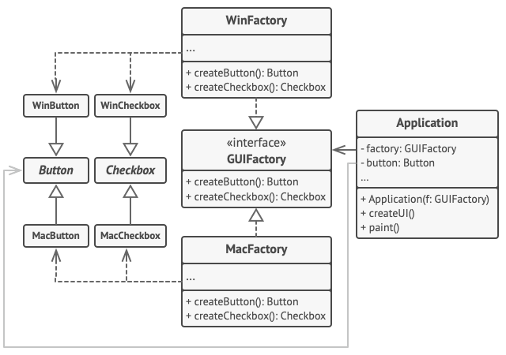

# Abstract Factory

## Πρόθεση

Το **Abstract Factory** είναι ένα δομικό μοτίβο σχεδίασης (creational design pattern) που σας επιτρέπει να παράγετε οικογένειες σχετικών αντικειμένων χωρίς να καθορίζετε τις συγκεκριμένες κλάσεις τους.


---

## Πρόβλημα

Φανταστείτε ότι δημιουργείτε έναν προσομοιωτή καταστήματος επίπλων. Ο κώδικάς σας αποτελείται από κλάσεις που αναπαριστούν:

1. Μια οικογένεια σχετικών προϊόντων, π.χ.: `Chair` + `Sofa` + `CoffeeTable`.   
2. Διάφορες παραλλαγές αυτής της οικογένειας. Για παράδειγμα, τα προϊόντα `Chair` + `Sofa` + `CoffeeTable` είναι διαθέσιμα σε αυτές τις παραλλαγές: `Modern`, `Victorian`, `ArtDeco`.   

|  | 
|:--:| 
| *Οικογένειες προϊόντων και τις παραλλαγές τους.* |

Χρειάζεστε έναν τρόπο να δημιουργείτε ξεχωριστά αντικείμενα επίπλων, έτσι ώστε να ταιριάζουν με άλλα αντικείμενα της ίδιας οικογένειας. Οι πελάτες απογοητεύονται πολύ όταν λαμβάνουν έπιπλα που δεν ταιριάζουν μεταξύ τους.

|  | 
|:--:| 
| *Ένας μοντέρνος καναπές δεν ταιριάζει με καρέκλες βικτοριανού στυλ.* |

Επιπλέον, δεν θέλετε να αλλάζετε τον υπάρχοντα κώδικα κάθε φορά που προσθέτετε νέα προϊόντα ή οικογένειες προϊόντων στο πρόγραμμα. Οι προμηθευτές επίπλων ενημερώνουν συχνά τους καταλόγους τους και δεν θέλετε να αλλάζετε τον βασικό κώδικα κάθε φορά που συμβαίνει αυτό.

---

## Λύση

Το πρώτο που προτείνει το μοτίβο Abstract Factory είναι να δηλώσετε ρητά διεπαφές (interfaces) για κάθε ξεχωριστό προϊόν της οικογένειας προϊόντων (π.χ., καρέκλα, καναπές ή τραπεζάκι καφέ). Στη συνέχεια, μπορείτε να κάνετε όλες τις παραλλαγές των προϊόντων να ακολουθούν αυτές τις διεπαφές. Για παράδειγμα, όλες οι παραλλαγές καρέκλας μπορούν να υλοποιούν τη διεπαφή `Chair`, όλες οι παραλλαγές τραπεζιών τη διεπαφή `CoffeeTable`, και ούτω καθεξής.

|  | 
|:--:| 
| *Όλες οι παραλλαγές του ίδιου αντικειμένου πρέπει να μετακινηθούν σε μια μοναδική ιεραρχία κλάσεων.* |

Το επόμενο βήμα είναι να δηλώσετε το _Abstract Factory_—μια διεπαφή με λίστα μεθόδων δημιουργίας για όλα τα προϊόντα που αποτελούν την οικογένεια προϊόντων (για παράδειγμα, `createChair`, `createSofa` και `createCoffeeTable`). Αυτές οι μέθοδοι πρέπει να επιστρέφουν **αφηρημένους** τύπους προϊόντων που εκπροσωπούνται από τις διεπαφές που ορίστηκαν προηγουμένως: `Chair`, `Sofa`, `CoffeeTable` κ.λπ.

|  | 
|:--:| 
| *Κάθε συγκεκριμένο εργοστάσιο αντιστοιχεί σε μια συγκεκριμένη παραλλαγή προϊόντος.* |

Τι γίνεται με τις παραλλαγές προϊόντων; Για κάθε παραλλαγή μιας οικογένειας προϊόντων, δημιουργούμε μια ξεχωριστή κλάση εργοστασίου βασισμένη στη διεπαφή `AbstractFactory`. Ένα εργοστάσιο είναι μια κλάση που επιστρέφει προϊόντα ενός συγκεκριμένου είδους. Για παράδειγμα, το `ModernFurnitureFactory` μπορεί να δημιουργήσει μόνο αντικείμενα `ModernChair`, `ModernSofa` και `ModernCoffeeTable`.

Ο κώδικας πελάτη πρέπει να λειτουργεί με εργοστάσια και προϊόντα μέσω των αντίστοιχων αφηρημένων διεπαφών τους. Αυτό σας επιτρέπει να αλλάξετε τον τύπο ενός εργοστασίου που περνάτε στον κώδικα πελάτη, καθώς και την παραλλαγή προϊόντος που λαμβάνει ο κώδικας πελάτη, χωρίς να διακόπτεται ο ίδιος ο κώδικας πελάτη.

|  | 
|:--:| 
| *Ο πελάτης δεν πρέπει να νοιάζεται για τη συγκεκριμένη κλάση του εργοστασίου με το οποίο συνεργάζεται.* |

Ας πούμε ότι ο πελάτης θέλει ένα εργοστάσιο να παράγει μια καρέκλα. Ο πελάτης δεν χρειάζεται να γνωρίζει την κλάση του εργοστασίου, ούτε έχει σημασία τι είδους καρέκλα θα πάρει. Είτε πρόκειται για ένα μοντέρνο μοντέλο είτε για μια καρέκλα βικτοριανού στυλ, ο πελάτης πρέπει να αντιμετωπίζει όλες τις καρέκλες με τον ίδιο τρόπο, χρησιμοποιώντας την αφηρημένη διεπαφή `Chair`. Με αυτή την προσέγγιση, το μόνο πράγμα που γνωρίζει ο πελάτης για την καρέκλα είναι ότι υλοποιεί με κάποιο τρόπο τη μέθοδο `sitOn`. Επίσης, όποια παραλλαγή της καρέκλας και αν επιστραφεί, θα ταιριάζει πάντα με τον τύπο του καναπέ ή του τραπεζιού του καφέ που παράγεται από το ίδιο αντικείμενο του εργοστασίου.

Μένει ακόμη ένα πράγμα να διευκρινιστεί: αν ο πελάτης είναι εκτεθειμένος μόνο στις αφηρημένες διεπαφές, τι δημιουργεί τα πραγματικά εργοστασιακά αντικείμενα; Συνήθως, η εφαρμογή δημιουργεί ένα συγκεκριμένο εργοστασιακό αντικείμενο στο στάδιο της αρχικοποίησης. Ακριβώς πριν από αυτό, η εφαρμογή πρέπει να επιλέξει τον τύπο του εργοστασίου ανάλογα με τη διαμόρφωση ή τις ρυθμίσεις του περιβάλλοντος.

---

## Δομή


1. Τα **Abstract Products** δηλώνουν διεπαφές για ένα σύνολο διαφορετικών αλλά συναφών προϊόντων που συνθέτουν μια οικογένεια προϊόντων.  
2. Τα **Concrete Products** είναι διάφορες υλοποιήσεις αφηρημένων προϊόντων, ομαδοποιημένες κατά παραλλαγές. Κάθε αφηρημένο προϊόν (καρέκλα/καναπές) πρέπει να υλοποιείται σε όλες τις δεδομένες παραλλαγές (βικτοριανή/μοντέρνα).   
3. Η διεπαφή **Abstract Factory** δηλώνει ένα σύνολο μεθόδων για τη δημιουργία καθενός από τα αφηρημένα προϊόντα   
4. Τα **Concrete Factories** υλοποιούν τις μεθόδους δημιουργίας του αφηρημένου εργοστασίου. Κάθε συγκεκριμένο εργοστάσιο αντιστοιχεί σε μια συγκεκριμένη παραλλαγή προϊόντων και δημιουργεί μόνο αυτές τις παραλλαγές προϊόντων.   
5. Αν και τα συγκεκριμένα εργοστάσια ενσαρκώνουν συγκεκριμένα προϊόντα, οι υπογραφές των μεθόδων δημιουργίας τους πρέπει να επιστρέφουν αντίστοιχα αφηρημένα προϊόντα. Με αυτόν τον τρόπο ο κώδικας του πελάτη που χρησιμοποιεί ένα εργοστάσιο δεν συνδέεται με τη συγκεκριμένη παραλλαγή του προϊόντος που λαμβάνει από ένα εργοστάσιο. Ο **πελάτης** μπορεί να συνεργαστεί με οποιαδήποτε συγκεκριμένη παραλλαγή εργοστασίου/προϊόντος, αρκεί να επικοινωνεί με τα αντικείμενά τους μέσω αφηρημένων διεπαφών.

---

## Ψευδοκώδικας

Αυτό το παράδειγμα δείχνει πώς το μοτίβο **Abstract Factory** μπορεί να χρησιμοποιηθεί για τη δημιουργία στοιχείων UI πολλαπλών πλατφορμών χωρίς να συνδέεται ο κώδικας του πελάτη με συγκεκριμένες κλάσεις UI, διατηρώντας παράλληλα όλα τα στοιχεία που δημιουργούνται συνεπή με ένα επιλεγμένο λειτουργικό σύστημα.

|  | 
|:--:| 
| *Το παράδειγμα κλάσεων UI cross-platform.* |

Τα ίδια στοιχεία UI σε μια εφαρμογή πολλαπλών πλατφορμών αναμένεται να συμπεριφέρονται παρόμοια, αλλά να φαίνονται λίγο διαφορετικά σε διαφορετικά λειτουργικά συστήματα. Επιπλέον, είναι δική σας δουλειά να βεβαιωθείτε ότι τα στοιχεία UI ταιριάζουν με το στυλ του τρέχοντος λειτουργικού συστήματος. Δεν θα θέλατε το πρόγραμμά σας να απεικονίζει στοιχεία ελέγχου macOS όταν εκτελείται στα Windows. 

Η διεπαφή Abstract Factory δηλώνει ένα σύνολο μεθόδων δημιουργίας που ο κώδικας του πελάτη μπορεί να χρησιμοποιήσει για την παραγωγή διαφορετικών τύπων στοιχείων UI. Τα συγκεκριμένα εργοστάσια αντιστοιχούν σε συγκεκριμένα λειτουργικά συστήματα και δημιουργούν τα στοιχεία UI που αντιστοιχούν στο συγκεκριμένο λειτουργικό σύστημα.

Λειτουργεί ως εξής: όταν μια εφαρμογή εκκινείται, ελέγχει τον τύπο του τρέχοντος λειτουργικού συστήματος. Η εφαρμογή χρησιμοποιεί αυτές τις πληροφορίες για να δημιουργήσει ένα εργοστασιακό αντικείμενο από μια κλάση που ταιριάζει με το λειτουργικό σύστημα. Ο υπόλοιπος κώδικας χρησιμοποιεί αυτό το εργοστάσιο για τη δημιουργία στοιχείων UI. Αυτό αποτρέπει τη δημιουργία λανθασμένων στοιχείων. 

Με αυτή την προσέγγιση, ο κώδικας του πελάτη δεν εξαρτάται από συγκεκριμένες κλάσεις εργοστασίων και στοιχείων UI, εφόσον συνεργάζεται με αυτά τα αντικείμενα μέσω των αφηρημένων διεπαφών τους. Αυτό επιτρέπει επίσης στον κώδικα πελάτη να υποστηρίζει άλλα εργοστάσια ή στοιχεία UI που μπορεί να προσθέσετε στο μέλλον. 

Ως αποτέλεσμα, δεν χρειάζεται να τροποποιείτε τον κώδικα πελάτη κάθε φορά που προσθέτετε μια νέα παραλλαγή στοιχείων UI στην εφαρμογή σας. Πρέπει απλώς να δημιουργήσετε μια νέα κλάση εργοστασίου που παράγει αυτά τα στοιχεία και να τροποποιήσετε ελαφρώς τον κώδικα αρχικοποίησης της εφαρμογής ώστε να επιλέγει αυτή την κλάση όταν χρειάζεται.

```
// The abstract factory interface declares a set of methods that
// return different abstract products. These products are called
// a family and are related by a high-level theme or concept.
// Products of one family are usually able to collaborate among
// themselves. A family of products may have several variants,
// but the products of one variant are incompatible with the
// products of another variant.
interface GUIFactory is
    method createButton():Button
    method createCheckbox():Checkbox


// Concrete factories produce a family of products that belong
// to a single variant. The factory guarantees that the
// resulting products are compatible. Signatures of the concrete
// factory's methods return an abstract product, while inside
// the method a concrete product is instantiated.
class WinFactory implements GUIFactory is
    method createButton():Button is
        return new WinButton()
    method createCheckbox():Checkbox is
        return new WinCheckbox()

// Each concrete factory has a corresponding product variant.
class MacFactory implements GUIFactory is
    method createButton():Button is
        return new MacButton()
    method createCheckbox():Checkbox is
        return new MacCheckbox()


// Each distinct product of a product family should have a base
// interface. All variants of the product must implement this
// interface.
interface Button is
    method paint()

// Concrete products are created by corresponding concrete
// factories.
class WinButton implements Button is
    method paint() is
        // Render a button in Windows style.

class MacButton implements Button is
    method paint() is
        // Render a button in macOS style.

// Here's the base interface of another product. All products
// can interact with each other, but proper interaction is
// possible only between products of the same concrete variant.
interface Checkbox is
    method paint()

class WinCheckbox implements Checkbox is
    method paint() is
        // Render a checkbox in Windows style.

class MacCheckbox implements Checkbox is
    method paint() is
        // Render a checkbox in macOS style.


// The client code works with factories and products only
// through abstract types: GUIFactory, Button and Checkbox. This
// lets you pass any factory or product subclass to the client
// code without breaking it.
class Application is
    private field factory: GUIFactory
    private field button: Button
    constructor Application(factory: GUIFactory) is
        this.factory = factory
    method createUI() is
        this.button = factory.createButton()
    method paint() is
        button.paint()


// The application picks the factory type depending on the
// current configuration or environment settings and creates it
// at runtime (usually at the initialization stage).
class ApplicationConfigurator is
    method main() is
        config = readApplicationConfigFile()

        if (config.OS == "Windows") then
            factory = new WinFactory()
        else if (config.OS == "Mac") then
            factory = new MacFactory()
        else
            throw new Exception("Error! Unknown operating system.")

        Application app = new Application(factory)
```

---

## Εφαρμοσιμότητα

* **Χρησιμοποιήστε το Abstract Factory όταν ο κώδικάς σας χρειάζεται να λειτουργεί με διάφορες οικογένειες σχετικών προϊόντων, αλλά δεν θέλετε να εξαρτάται από τις συγκεκριμένες κλάσεις αυτών των προϊόντων—αυτές μπορεί να είναι άγνωστες εκ των προτέρων ή απλά θέλετε να επιτρέψετε μελλοντική επεκτασιμότητα.**   

* Το Abstract Factory σας παρέχει μια διεπαφή για τη δημιουργία αντικειμένων από κάθε κλάση της οικογένειας προϊόντων. Όσο ο κώδικάς σας δημιουργεί αντικείμενα μέσω αυτής της διεπαφής, δεν χρειάζεται να ανησυχείτε για τη δημιουργία μιας λανθασμένης παραλλαγής προϊόντος που δεν ταιριάζει με τα ήδη δημιουργημένα προϊόντα της εφαρμογής σας.   

* **Σκεφτείτε την υλοποίηση του Abstract Factory όταν έχετε μια κλάση με μια ομάδα [Factory Methods](https://refactoring.guru/design-patterns/factory-method) που θολώνουν την κύρια ευθύνη της.**  

* Σε ένα καλά σχεδιασμένο πρόγραμμα, _κάθε κλάση είναι υπεύθυνη μόνο για ένα πράγμα_. Όταν μια κλάση ασχολείται με πολλούς τύπους προϊόντων, ίσως αξίζει να εξαγάγετε τις μεθόδους εργοστασίου της σε μια ανεξάρτητη κλάση εργοστασίου ή σε μια πλήρη υλοποίηση Abstract Factory.   

---

## Πώς να το υλοποιήσετε

1. Χαρτογραφήστε έναν πίνακα με τους ξεχωριστούς τύπους προϊόντων έναντι των παραλλαγών αυτών των προϊόντων.   
2. Δηλώστε αφηρημένες διεπαφές προϊόντων για όλους τους τύπους προϊόντων. Στη συνέχεια, κάντε όλες τις συγκεκριμένες κλάσεις προϊόντων να υλοποιούν αυτές τις διεπαφές.   
3. Δηλώστε τη διεπαφή του Abstract Factory με μια ομάδα μεθόδων δημιουργίας για όλα τα αφηρημένα προϊόντα.   
4. Υλοποιήστε μια ομάδα συγκεκριμένων κλάσεων εργοστασίου, μία για κάθε παραλλαγή προϊόντος.   
5. Δημιουργήστε κώδικα αρχικοποίησης εργοστασίου κάπου στην εφαρμογή. Αυτός θα πρέπει να δημιουργεί μια από τις συγκεκριμένες κλάσεις εργοστασίου, ανάλογα με τη ρύθμιση της εφαρμογής ή το τρέχον περιβάλλον. Περάστε αυτό το αντικείμενο εργοστασίου σε όλες τις κλάσεις που κατασκευάζουν προϊόντα.    
6. Σαρώστε τον κώδικα και βρείτε όλες τις άμεσες κλήσεις σε κατασκευαστές προϊόντων. Αντικαταστήστε τες με κλήσεις στην κατάλληλη μέθοδο δημιουργίας του αντικειμένου εργοστασίου.    

---

## Πλεονεκτήματα και Μειονεκτήματα

### Πλεονεκτήματα
*   Μπορείτε να είστε βέβαιοι ότι τα προϊόντα που λαμβάνετε από ένα εργοστάσιο είναι συμβατά μεταξύ τους.   
*   Αποφεύγετε τη στενή σύζευξη μεταξύ συγκεκριμένων προϊόντων και του κώδικα πελάτη.   
*   _Αρχή Μοναδικής Ευθύνης_. Μπορείτε να εξάγετε τον κώδικα δημιουργίας προϊόντων σε ένα μόνο σημείο, κάνοντας τον κώδικα ευκολότερο στη συντήρηση.   
*   _Αρχή Ανοικτού/Κλειστού_. Μπορείτε να εισαγάγετε νέες παραλλαγές προϊόντων χωρίς να διακόπτετε τον υπάρχοντα κώδικα πελάτη.   

### Μειονεκτήματα
*   Ο κώδικας μπορεί να γίνει πιο περίπλοκος από όσο πρέπει, καθώς εισάγονται πολλές νέες διεπαφές και κλάσεις μαζί με το μοτίβο.

---

## Σχέσεις με Άλλα Μοτίβα

*   Πολλά σχέδια ξεκινούν με τη χρήση του [Factory Method](https://refactoring.guru/design-patterns/factory-method) (λιγότερο περίπλοκο και πιο προσαρμόσιμο μέσω υποκλάσεων) και εξελίσσονται προς το [Abstract Factory](https://refactoring.guru/design-patterns/abstract-factory), το [Prototype](https://refactoring.guru/design-patterns/prototype) ή το [Builder](https://refactoring.guru/design-patterns/builder) (πιο ευέλικτο αλλά πιο περίπλοκο).
*   Το [Builder](https://refactoring.guru/design-patterns/builder) επικεντρώνεται στην κατασκευή σύνθετων αντικειμένων βήμα προς βήμα. Το [Abstract Factory](https://refactoring.guru/design-patterns/abstract-factory) ειδικεύεται στη δημιουργία οικογενειών σχετικών αντικειμένων. Το _Abstract Factory_ επιστρέφει το προϊόν άμεσα, ενώ το _Builder_ σας επιτρέπει να εκτελείτε κάποια επιπλέον βήματα κατασκευής πριν λάβετε το προϊόν.
*   Οι κλάσεις [Abstract Factory](https://refactoring.guru/design-patterns/abstract-factory) συχνά βασίζονται σε μια ομάδα [Factory Methods](https://refactoring.guru/design-patterns/factory-method), αλλά μπορείτε επίσης να χρησιμοποιήσετε το [Prototype](https://refactoring.guru/design-patterns/prototype) για να συνθέσετε τις μεθόδους αυτών των κλάσεων.
*   Το [Abstract Factory](https://refactoring.guru/design-patterns/abstract-factory) μπορεί να λειτουργήσει ως εναλλακτική στο [Facade](https://refactoring.guru/design-patterns/facade) όταν θέλετε μόνο να αποκρύψετε τον τρόπο δημιουργίας των αντικειμένων υποσυστήματος από τον κώδικα πελάτη.
*   Μπορείτε να χρησιμοποιήσετε το [Abstract Factory](https://refactoring.guru/design-patterns/abstract-factory) μαζί με το [Bridge](https://refactoring.guru/design-patterns/bridge). Αυτός ο συνδυασμός είναι χρήσιμος όταν ορισμένες αφαιρέσεις που ορίζονται από το _Bridge_ μπορούν να λειτουργούν μόνο με συγκεκριμένες υλοποιήσεις. Σε αυτή την περίπτωση, το _Abstract Factory_ μπορεί να ενσωματώσει αυτές τις σχέσεις και να αποκρύψει την πολυπλοκότητα από τον κώδικα πελάτη.
*   Τα [Abstract Factories](https://refactoring.guru/design-patterns/abstract-factory), οι [Builders](https://refactoring.guru/design-patterns/builder) και τα [Prototypes](https://refactoring.guru/design-patterns/prototype) μπορούν όλα να υλοποιηθούν ως [Singletons](https://refactoring.guru/design-patterns/singleton).

---
# Παραδείγματα κώδικα


## Abstract Factory με Java

Το **Abstract Factory** είναι ένα πρότυπο δημιουργικής σχεδίασης, το οποίο επιλύει το πρόβλημα της δημιουργίας ολόκληρων οικογενειών προϊόντων χωρίς να καθορίζονται οι συγκεκριμένες κλάσεις τους. 

Το Abstract Factory ορίζει μια διεπαφή για τη δημιουργία όλων των ξεχωριστών προϊόντων, αλλά αφήνει την πραγματική δημιουργία προϊόντων στις συγκεκριμένες κλάσεις εργοστασίων. Κάθε τύπος εργοστασίου αντιστοιχεί σε μια συγκεκριμένη ποικιλία προϊόντων. 

Ο κώδικας του πελάτη καλεί τις μεθόδους δημιουργίας ενός αντικειμένου εργοστασίου αντί να δημιουργεί προϊόντα απευθείας με κλήση κατασκευαστή (τελεστής `new`). Δεδομένου ότι ένα εργοστάσιο αντιστοιχεί σε μία μόνο παραλλαγή προϊόντος, όλα τα προϊόντα του θα είναι συμβατά. 

Ο κώδικας πελάτη συνεργάζεται με τα εργοστάσια και τα προϊόντα μόνο μέσω των αφηρημένων διεπαφών τους. Αυτό επιτρέπει στον κώδικα πελάτη να εργάζεται με οποιεσδήποτε παραλλαγές προϊόντων, που έχουν δημιουργηθεί από το αντικείμενο του εργοστασίου. Απλά δημιουργείτε μια νέα συγκεκριμένη εργοστασιακή κλάση και τη μεταβιβάζετε στον κώδικα πελάτη.

**Παραδείγματα χρήσης**: Το πρότυπο Abstract Factory είναι αρκετά συνηθισμένο στον κώδικα της Java. Πολλά πλαίσια και βιβλιοθήκες το χρησιμοποιούν για να παρέχουν έναν τρόπο επέκτασης και προσαρμογής των τυποποιημένων συστατικών τους. 

Ακολουθούν μερικά παραδείγματα από βασικές βιβλιοθήκες της Java: 
- [javax.xml.parsers.DocumentBuilderFactory#newInstance()](http://docs.oracle.com/javase/8/docs/api/javax/xml/parsers/DocumentBuilderFactory.html#newInstance--)   
- [javax.xml.transform.TransformerFactory#newInstance()](http://docs.oracle.com/javase/8/docs/api/javax/xml/transform/TransformerFactory.html#newInstance--)    
- [javax.xml.xpath.XPathFactory#newInstance()](http://docs.oracle.com/javase/8/docs/api/javax/xml/xpath/XPathFactory.html#newInstance--)   

**Αναγνώριση**: Το πρότυπο αναγνωρίζεται εύκολα από τις μεθόδους, οι οποίες επιστρέφουν ένα αντικείμενο εργοστασίου. Στη συνέχεια, το εργοστάσιο χρησιμοποιείται για τη δημιουργία συγκεκριμένων υπο-συστατικών.

---

## Οικογένειες συστατικών GUI πολλαπλών πλατφορμών και η παραγωγή τους

Σε αυτό το παράδειγμα, τα κουμπιά και τα πλαίσια ελέγχου θα λειτουργούν ως προϊόντα. Έχουν δύο παραλλαγές: macOS και Windows. 

Το αφηρημένο εργοστάσιο ορίζει μια διεπαφή για τη δημιουργία κουμπιών και checkboxes. Υπάρχουν δύο συγκεκριμένα εργοστάσια, τα οποία επιστρέφουν και τα δύο προϊόντα σε μία μόνο παραλλαγή. 

Ο κώδικας του πελάτη λειτουργεί με τα εργοστάσια και τα προϊόντα χρησιμοποιώντας αφηρημένες διεπαφές. Κάνει τον ίδιο κώδικα πελάτη να λειτουργεί με πολλές παραλλαγές προϊόντων, ανάλογα με τον τύπο του αντικειμένου του εργοστασίου.

### buttons: Πρώτη ιεραρχία προϊόντων

* **buttons/Button.java**
```java
package refactoring_guru.abstract_factory.example.buttons;

/**
 * Abstract Factory assumes that you have several families of products,
 * structured into separate class hierarchies (Button/Checkbox). All products of
 * the same family have the common interface.
 *
 * This is the common interface for buttons family.
 */
public interface Button {
    void paint();
}
```

* **buttons/MacOSButton.java**

```java
package refactoring_guru.abstract_factory.example.buttons;

/**
 * All products families have the same varieties (MacOS/Windows).
 *
 * This is a MacOS variant of a button.
 */
public class MacOSButton implements Button {

    @Override
    public void paint() {
        System.out.println("You have created MacOSButton.");
    }
}
```

* **buttons/WindowsButton.java**
```java
package refactoring_guru.abstract_factory.example.buttons;

/**
 * All products families have the same varieties (MacOS/Windows).
 *
 * This is another variant of a button.
 */
public class WindowsButton implements Button {

    @Override
    public void paint() {
        System.out.println("You have created WindowsButton.");
    }
}
```

### checkboxes: Δεύτερη ιεραρχία προϊόντων

* **checkboxes/Checkbox.java**
```java
package refactoring_guru.abstract_factory.example.checkboxes;

/**
 * Checkboxes is the second product family. It has the same variants as buttons.
 */
public interface Checkbox {
    void paint();
}
```

* **checkboxes/MacOSCheckbox.java**
```java
package refactoring_guru.abstract_factory.example.checkboxes;

/**
 * All products families have the same varieties (MacOS/Windows).
 *
 * This is a variant of a checkbox.
 */
public class MacOSCheckbox implements Checkbox {

    @Override
    public void paint() {
        System.out.println("You have created MacOSCheckbox.");
    }
}
```

* **checkboxes/WindowsCheckbox.java**
```java
package refactoring_guru.abstract_factory.example.checkboxes;

/**
 * All products families have the same varieties (MacOS/Windows).
 *
 * This is another variant of a checkbox.
 */
public class WindowsCheckbox implements Checkbox {

    @Override
    public void paint() {
        System.out.println("You have created WindowsCheckbox.");
    }
}
```

### factories

* **factories/GUIFactory.java**: Abstract factory
```java
package refactoring_guru.abstract_factory.example.factories;

import refactoring_guru.abstract_factory.example.buttons.Button;
import refactoring_guru.abstract_factory.example.checkboxes.Checkbox;

/**
 * Abstract factory knows about all (abstract) product types.
 */
public interface GUIFactory {
    Button createButton();
    Checkbox createCheckbox();
}
```

* **factories/MacOSFactory.java**: Concrete factory (macOS)
```java
package refactoring_guru.abstract_factory.example.factories;

import refactoring_guru.abstract_factory.example.buttons.Button;
import refactoring_guru.abstract_factory.example.buttons.MacOSButton;
import refactoring_guru.abstract_factory.example.checkboxes.Checkbox;
import refactoring_guru.abstract_factory.example.checkboxes.MacOSCheckbox;

/**
 * Each concrete factory extends basic factory and responsible for creating
 * products of a single variety.
 */
public class MacOSFactory implements GUIFactory {

    @Override
    public Button createButton() {
        return new MacOSButton();
    }

    @Override
    public Checkbox createCheckbox() {
        return new MacOSCheckbox();
    }
}
```

* **factories/WindowsFactory.java**: Concrete factory (Windows)
```java
package refactoring_guru.abstract_factory.example.factories;

import refactoring_guru.abstract_factory.example.buttons.Button;
import refactoring_guru.abstract_factory.example.buttons.WindowsButton;
import refactoring_guru.abstract_factory.example.checkboxes.Checkbox;
import refactoring_guru.abstract_factory.example.checkboxes.WindowsCheckbox;

/**
 * Each concrete factory extends basic factory and responsible for creating
 * products of a single variety.
 */
public class WindowsFactory implements GUIFactory {

    @Override
    public Button createButton() {
        return new WindowsButton();
    }

    @Override
    public Checkbox createCheckbox() {
        return new WindowsCheckbox();
    }
}
```

### app

* **app/Application.java**: Client code
```java
package refactoring_guru.abstract_factory.example.app;

import refactoring_guru.abstract_factory.example.buttons.Button;
import refactoring_guru.abstract_factory.example.checkboxes.Checkbox;
import refactoring_guru.abstract_factory.example.factories.GUIFactory;

/**
 * Factory users don't care which concrete factory they use since they work with
 * factories and products through abstract interfaces.
 */
public class Application {
    private Button button;
    private Checkbox checkbox;

    public Application(GUIFactory factory) {
        button = factory.createButton();
        checkbox = factory.createCheckbox();
    }

    public void paint() {
        button.paint();
        checkbox.paint();
    }
}
```

* **Demo.java**: App configuration
```java
package refactoring_guru.abstract_factory.example;

import refactoring_guru.abstract_factory.example.app.Application;
import refactoring_guru.abstract_factory.example.factories.GUIFactory;
import refactoring_guru.abstract_factory.example.factories.MacOSFactory;
import refactoring_guru.abstract_factory.example.factories.WindowsFactory;

/**
 * Demo class. Everything comes together here.
 */
public class Demo {

    /**
     * Application picks the factory type and creates it in run time (usually at
     * initialization stage), depending on the configuration or environment
     * variables.
     */
    private static Application configureApplication() {
        Application app;
        GUIFactory factory;
        String osName = System.getProperty("os.name").toLowerCase();
        if (osName.contains("mac")) {
            factory = new MacOSFactory();
        } else {
            factory = new WindowsFactory();
        }
        app = new Application(factory);
        return app;
    }

    public static void main(String[] args) {
        Application app = configureApplication();
        app.paint();
    }
}
```

### OutputDemo.txt: Execution result
```
You create WindowsButton.
You created WindowsCheckbox.
```

---

# ΠΗΓΕΣ:
- [Abstract Factory](https://refactoring.guru/design-patterns/abstract-factory)   
- [Abstract Factory in Java](https://refactoring.guru/design-patterns/abstract-factory/java/example)   

---

# BINTEO

## FACTORY
- [The Factory Method Pattern Explained and Implemented in Java | Creational Design Patterns | Geekific](https://youtu.be/EdFq_JIThqM?si=OlS5IChVzsPDpBlg)    
- [Factory Method Pattern – Design Patterns (ep 4)](https://youtu.be/EcFVTgRHJLM?si=2E41jXOmhfENtT0L)   
- [The Factory Design Pattern In Java](https://youtu.be/q6xHRXI93sM?si=15ammE27duXJEqdZ)   

## ABSTRACT FACTORY
- [The Abstract Factory Pattern Explained and Implemented | Creational Design Patterns | Geekific](https://youtu.be/QNpwWkdFvgQ?si=kOVvsuVfBP9kVZEW)   
- [Abstract Factory Pattern – Design Patterns (ep 5)](https://youtu.be/v-GiuMmsXj4?si=Wkyh-pmayWu5sPA_)   
- [The Abstract Factory Design Pattern In Java](https://youtu.be/5HF6l7H80nM?si=6l7N6CPy-UhqL3h9)
